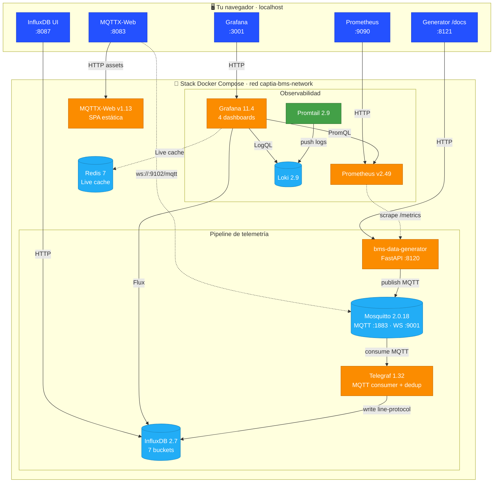

<div align="center">

# CAPTIA-SYNTHETIC-DATA-BMS

**Get Started | levanta el stack BMS en 5 pasos y visualiza datos en menos de 10 minutos**

[](https://captia-technology.github.io/captia-synthetic-data-bms/)
[](https://github.com/captia-technology/captia-synthetic-data-bms/actions/workflows/ci.yml)
[](https://github.com/captia-technology/captia-synthetic-data-bms/actions/workflows/deploy-docs.yml)
[](https://github.com/captia-technology/captia-synthetic-data-bms/actions/workflows/security.yml)
[](https://www.python.org/)
[](https://fastapi.tiangolo.com/)
[](https://docs.docker.com/compose/)
[](https://www.influxdata.com/)
[](https://grafana.com/)
[](LICENSE)
[](docs/specs/synthetic-bms/)


📖 **Documentación**: <https://captia-technology.github.io/captia-synthetic-data-bms/>
🌐 **Plataforma comercial**: <https://captiatechnology.com>

</div>

## Quiénes somos

> **"Operacionalizamos inteligencia en entornos reales."**
> — claim corporativo de CAPTIA Technology

**CAPTIA Technology** es una *empresa-sistema* industrial: conecta sistemas,
energía, datos y negocio para transformar operaciones fragmentadas en
sistemas inteligentes y accionables. La propuesta gira en torno a una
arquitectura integrada que conecta **lo existente** (PLC, sensores, ERP) con
**lo nuevo** (visibilidad operativa en tiempo real e IA aplicada) sin
*rip-and-replace*.

La suite Captia se compone de cinco productos articulados como una cadena de valor:

| Producto | Rol en la cadena | Qué hace (descripción literal) |
|----------|------------------|-------------------------------|
| **Captia Consulting** | Define y diseña | Assessment operacional |
| **Captia Connect** | Conecta e integra | Sistemas conectados (PLC, sensores, ERP) |
| **Captia AI** | Interpreta y automatiza | Dashboards operacionales |
| **Captia Energy** | Integra la capa energética | Capa energética conectada y monitorizada |
| **Captia Service** | Ejecuta en la capa de negocio | Implantaciones Odoo |

**Sectores objetivo** declarados en captiatechnology.com: *plantas industriales,
instalaciones energéticas y operaciones de producción*. Stack tecnológico de
referencia: Odoo, PLC, sensores, ERP.

> Más información: <https://captiatechnology.com>.

---

## Qué es este repo

> **CAPTIA Synthetic Data BMS** es la primera apertura **open-source bajo
> Apache 2.0** del ecosistema CAPTIA. Un microservicio que genera
> telemetría sintética realista de aulas educativas (CO₂, temperatura,
> humedad, ocupación, climatización, consumo eléctrico), la publica con
> los topics MQTT y schema exactos de CAPTIA en producción y la visualiza
> end-to-end (MQTT → Telegraf → InfluxDB → Grafana).

**Sirve para**:
- Entrenar modelos ML de forecasting, anomalías HVAC, IAQ.
- Probar el pipeline IoT entero sin depender de telemetría real.
- Banco de pruebas docente para FP IES Simarro y partners académicos.
- Demostrar el rigor técnico de la suite CAPTIA (10 patches físicos con
  tests, score realismo 0.94, schema canónico inviolable).

100 % datos sintéticos · sin PII · `seed=42` reproducible bit-a-bit · 45 notebooks didácticos.

---

## Lo que vas a tener funcionando en 10 minutos



> **Lectura del flujo**: el generator **publica** vía MQTT al broker Mosquitto.
> Telegraf **consume** del broker y **escribe** a InfluxDB (no hay flecha directa
> Mosquitto → InfluxDB). Prometheus hace **scrape** del `/metrics` del generator.
> Grafana lee de InfluxDB (Flux), Prometheus (PromQL) y Loki (LogQL) según el panel.

**10 contenedores en total**: `bms-data-generator`, `mosquitto`, `telegraf`,
`influxdb`, `grafana`, `prometheus`, `loki`, `promtail`, `redis`, `mqttx-web`.
Todos con healthchecks, todos con tag de imagen fijo (no `latest`).

---

## Antes de empezar: requisitos

| Herramienta | Versión mínima | Para qué |
|-------------|----------------|----------|
| **Docker Desktop** | 24+ con Compose v2 | Ejecuta los 10 contenedores |
| **Git** | 2.0+ | Clonar el repo |
| **Make** | GNU Make 3.81+ | Atajos `make demo`, `make smoke`, etc. |
| **Bash** | 4.0+ (incluido en Git for Windows) | Los scripts `.sh` lo necesitan |

> **Windows**: Git for Windows ya trae `bash` (Git Bash). Para `make`:
> `winget install GnuWin32.Make` o `scoop install make`. **macOS**: `brew install make`.
> **Linux**: ya viene.

Verifica que tienes todo:

```bash
docker --version           # >= 24
docker compose version     # v2
git --version              # >= 2
make --version             # >= 3.81
bash --version             # >= 4
```

---

## Get Started en 5 pasos

### Paso 1 · Clonar el repo (30 s)

```bash
git clone https://github.com/captia-technology/captia-synthetic-data-bms.git
cd captia-synthetic-data-bms
```

### Paso 2 · Generar el archivo `.env` con secretos (5 s)

```bash
make init-env
```

Esto crea `.env` a partir de `.env.example` rellenando los `CHANGE_ME` con
tokens aleatorios (`INFLUXDB_TOKEN`, `BMS_API_TOKEN`, `INFLUXDB_ADMIN_PASSWORD`).
Es **idempotente**: si ya existe `.env`, no toca nada. Para regenerarlo:
`make init-env-force`.

### Paso 3 · Levantar el stack (3–6 min la primera vez)

Tienes **tres modos** según tu objetivo:

| Comando | Qué hace | Cuándo usarlo |
|---------|----------|---------------|
| **`make demo`** ⭐ | Levanta toda la infra (sin build local). Verifica healthchecks + smoke. | **Recomendado para empezar** — más rápido, no necesita Python local |
| `make quickstart` | Igual que `demo` + build del generator FastAPI desde código fuente | Si vas a tocar el código del generator |
| `make up` | Solo `docker compose up -d`. No espera healthchecks. | Avanzado / scripts |

```bash
make demo
```

La primera vez tarda **3–6 min** (descarga de imágenes Docker). Las siguientes,
**< 60 s**. Verás algo como:

```
==> Preflight CAPTIA-SYNTHETIC-DATA-BMS
  OK docker 25.0.3 corriendo
  OK docker compose v2.24.5 disponible
  OK .env presente
==> docker compose up -d
[+] Running 11/11 ...
==> Esperando healthchecks (max 120 s)
  OK 10 services healthy
==> Smoke MQTT OK
==> Smoke InfluxDB OK
==> Smoke Grafana OK
==> Stack BMS listo.
```

> Si algo falla aquí, salta directo a [Troubleshooting](#troubleshooting-express).

### Paso 4 · Verificar que todo está sano (10 s)

```bash
make ps        # listar 10 contenedores Up (healthy)
make smoke     # MQTT publish + Influx buckets + Grafana datasources + schema
```

Salida esperada de `make smoke`:

```
==> Smoke MQTT (puerto 1884)         - publish OK
==> Smoke InfluxDB (http://localhost:8087)  - 7 buckets canónicos presentes
==> Smoke Grafana (http://localhost:3001)   - datasources provisionados (4)
==> Schema canónico CAPTIA verificado
```

Si algún check falla, mira `make logs SERVICE=<nombre>` y consulta
[`docs/TROUBLESHOOTING.md`](docs/TROUBLESHOOTING.md).

### Paso 5 · Abrir las UIs (30 s)

```bash
make urls    # imprime los URLs útiles
```

Abre en tu navegador (orden recomendado para una primera vez):

1. **Grafana** → <http://localhost:3001> (`admin` / `admin`)
   - Dashboard recomendado: **System Health Cockpit** (UID `bms-overview`)
2. **MQTTX-Web** → <http://localhost:8083>
   - Importa la config preconfigurada: `infra/mqttx/captia-bms-mqttx-config.json`
   - 7 suscripciones listas + 2 scripts de decode (ver [`infra/mqttx/README.md`](infra/mqttx/README.md))
3. **InfluxDB UI** → <http://localhost:8087> (`admin` / valor de `INFLUXDB_ADMIN_PASSWORD` en `.env`)
4. **OpenAPI del generator** → <http://localhost:8121/docs>

> **Guía completa con queries listas para pegar**: [`docs/operations/visualizing-data.md`](docs/operations/visualizing-data.md)

---

## Acceso a las UIs (mapa maestro)

| Servicio | URL local | Credenciales | Para qué |
|----------|-----------|--------------|----------|
| **Grafana** | <http://localhost:3001> | `admin` / `admin` | 4 dashboards: overview, energy, faults, IAQ |
| **MQTTX-Web** | <http://localhost:8083> | — (importar JSON) | Ver tráfico MQTT en vivo |
| **InfluxDB UI** | <http://localhost:8087> | `admin` / `INFLUXDB_ADMIN_PASSWORD` | Queries Flux, gestión buckets |
| **Generator API** | <http://localhost:8121> | `Bearer BMS_API_TOKEN` | Control plane (`/v1/control`, `/v1/datasets`) |
| **Generator OpenAPI** | <http://localhost:8121/docs> | — | Swagger UI |
| **Generator metrics** | <http://localhost:8121/metrics> | — | Métricas Prometheus raw |
| **Prometheus** | <http://localhost:9090> | — | Tiempo-series del propio stack |
| **Loki API** | <http://localhost:3100/ready> | — | Logs centralizados (consulta vía Grafana → Explore) |
| **Mosquitto MQTT (TCP)** | `tcp://localhost:1884` | anonymous (dev) | Para `mosquitto_pub` / `mosquitto_sub` |
| **Mosquitto MQTT (WebSocket)** | `ws://localhost:9102/mqtt` | anonymous (dev) | Para clientes browser |

> **Aviso seguridad** — `admin/admin` y `allow_anonymous true` son **solo para desarrollo**.
> Antes de exponer el stack en cualquier red, lee [`SECURITY.md`](SECURITY.md).

---

## Comandos del día a día

```bash
# Estado
make ps                    # ver contenedores
make logs                  # tail de todos
make logs SERVICE=grafana  # tail de uno solo
make urls                  # imprimir URLs

# Verificación
make smoke                 # 4 smoke checks (MQTT + Influx + Grafana + schema)

# Apagar / limpiar
make down                  # detener (PRESERVA datos)
make clean                 # detener + BORRAR volúmenes (datos perdidos)

# Generar dumps offline (sin necesidad de Grafana)
make dump-caseB            # 12 meses consumo eléctrico (line-protocol)
make dump-caseC            # 6 meses con averías HVAC
make dump-caseD            # 3 meses calidad aire @ 1 min

# Tests
make test                  # unit (rápido, < 1 s)
make test-integration      # integration
make test-snapshot         # determinismo seed=42
make test-all              # todo el árbol

# Re-arrancar tras cambio de código del generator
make quickstart            # rebuilda + sube
```

Lista completa con `make help`.

---

## Generación de datasets sintéticos

Este repo soporta **dos vías** para producir datasets:

1. **Mocks didácticos** (`notebooks/_data/`) — generados con `numpy` desde
   `notebooks/_common/synthetic_mocks.py`, ligeros, sin necesidad de stack.
2. **Datasets canónicos del generador BMS** (`notebooks/_data/3y/`) —
   producidos por el generador hexagonal (`vendor/synthetic-generator/`)
   ejecutando los escenarios YAML, con schema canónico CAPTIA.

### A. Mocks didácticos (1 año, sin stack)

Para reproducir los mocks que están en `notebooks/_data/*.csv`:

```bash
uv run python scripts/build_notebook_data.py
```

Genera 6 ficheros (~5 MB total) en menos de 5 segundos. Re-ejecuciones
son **bit-a-bit idénticas** (`seed=42`).

| Mock | Caso ML | Periodo | Granularidad |
|---|---|---|---|
| `ingauge_aula01_mock.csv` | A, D | 1 semana | 1 min |
| `bdg2_education_subset_mock.csv` | B, I | 12 meses | horaria |
| `lbnl_fdd_rtu_mock.csv` | C, G | 14 días | 1 min |
| `era5_xativa_mock.csv` | E | 30 días | horaria |
| `traffic_camera_mock.csv` | J | 7 días | 15 min |
| `chatbot_golden_set.csv` | H | n/a | 40 preguntas |

### B. Mocks enriquecidos de 3 años

Para casos avanzados (SARIMA estacional, LSTM, benchmark Spark) hay
**versiones extendidas comprimidas con gzip** en `notebooks/_data/3y/`:

```bash
# Local (sin stack):
uv run python scripts/build_3year_datasets.py

# Con export del generador BMS canónico (requiere stack vivo + .env):
uv run python scripts/build_3year_datasets.py --include-bms
```

| Dataset | Filas | Tamaño | Columnas extra vs 1 año |
|---|---|---|---|
| `bdg2_education_subset_3y.csv.gz` | 155 520 | 1.7 MB | year/month/dow/hour/season/is_weekend/is_school_hours |
| `era5_xativa_3y.csv.gz` | 26 280 | 0.45 MB | dew_point_c (Magnus)/RH/solar_zenith_deg (lat 38.99°N) |
| `ingauge_aula01_3y.csv.gz` | 315 360 | 5.1 MB | iaq_index (EPA-like)/comfort_pmv (Fanger)/power_w |
| `lbnl_fdd_rtu_3y.csv.gz` | 315 360 | 2.3 MB | fault_label/fault_severity siempre presentes |
| `traffic_camera_3y.csv.gz` | 210 240 | 1.3 MB | cars/trucks/motorbikes/bicycles + congestion_level |

> **Por qué 3 años**: SARIMA estacional anual necesita ≥ 2 años para varianza
> estacional; LSTM y Transformer 2-3 años para validación rolling robusta;
> benchmarks Big Data Spark necesitan > 1 M filas para salir del rango
> pandas-friendly. Detalle en
> [`notebooks/_data/3y/README.md`](notebooks/_data/3y/README.md).

### C. Dataset BMS canónico (output real del generador)

⭐ **Esta es la salida real del generador hexagonal** que está en
`vendor/synthetic-generator/`, idéntica bit-a-bit a la que produce el
stack de producción CAPTIA.

#### Producirlo end-to-end (requiere stack vivo)

```bash
# 1. Levantar el stack
make demo

# 2. Lanzar export via API (POST /v1/datasets/export)
TOKEN=$(grep ^BMS_API_TOKEN= .env | cut -d= -f2-)
curl -X POST http://localhost:8121/v1/datasets/export \
  -H "Authorization: Bearer $TOKEN" \
  -H "Content-Type: application/json" \
  -d '{
    "config_path": "/app/config/projects/bms_v1_caseB_consumption.yaml",
    "format": "csv_long",
    "months": 12,
    "include_faults": false
  }'
# → {"job_id":"abc123...","output_path":"/app/output/ies_simarro_12m_abc123.csv"}

# 3. Esperar a que termine (~30-90 s para 12 meses, 10 aulas, 5min)
sleep 60
curl -fsS -H "Authorization: Bearer $TOKEN" \
  http://localhost:8121/v1/datasets/jobs/<job_id>

# 4. Copiar output del contenedor al host
docker cp captia-bms-generator:/app/output/ies_simarro_12m_<job_id>.csv ./output/

# 5. Comprimir (380 MB → ~15 MB con gzip-9)
gzip -9 output/ies_simarro_12m_<job_id>.csv

# 6. (Opcional) mover al área de notebooks
mv output/ies_simarro_12m_<job_id>.csv.gz \
   notebooks/_data/3y/bms_simarro_canonical_12m.csv.gz
```

#### Schema canónico CAPTIA producido

12 columnas, equivalente directo al InfluxDB measurement `captia_point`:

```csv
timestamp,domain_id,site_id,asset_id,variable,value,unit,data_type,point_type,quality,origin,pvn
2025-09-01T00:00:00+02:00,bms_classrooms,ies_simarro,AULA01,temperature_01,21.4463,°C,float,sensor,OK,synthetic,AULA01__temperature_01
```

| Columna | Significado |
|---|---|
| `timestamp` | ISO 8601 con TZ Europe/Madrid |
| `domain_id` | `bms_classrooms` (canónico) |
| `site_id` | `ies_simarro` (canónico) |
| `asset_id` | `AULA01..AULA10` |
| `variable` | 22 variables (`temperature_01`, `co2`, `relative-humidity`, ...) |
| `value` | Field canónico (float) |
| `unit` | `°C`, `ppm`, `%`, `W`, etc. |
| `data_type` | `float`, `boolean`, `int` |
| `point_type` | `sensor`, `actuator`, `derived` |
| `quality` | `OK`, `BAD`, `STALE` |
| `origin` | `synthetic` (este repo) o `simarro-prod` (real) |
| `pvn` | Process Variable Name = `${asset_id}__${variable}` |

#### Escenarios disponibles (`config/projects/`)

| YAML | Periodo | Granularidad | Aulas | Faults | Tamaño esperado |
|---|---|---|---|---|---|
| `bms_v1_demo.yaml` | 30 días | 5 min | 10 | no | ~25 MB CSV |
| `bms_v1_caseA_e2e_host.yaml` | live | 5 s | 10 | no | continuo |
| `bms_v1_caseB_consumption.yaml` ⭐ | **12 meses** | 5 min | 10 | no | **380 MB CSV → 15 MB gz** |
| `bms_v1_caseC_faults.yaml` | 6 meses | 5 min | 10 | sí (4 tipos) | ~190 MB CSV → 8 MB gz |
| `bms_v1_caseD_iaq.yaml` | 3 meses | 1 min | 10 | no | ~480 MB CSV → 20 MB gz |
| `bms_v1_3years.yaml` | **3 años** | 5 min | 10 | no | ~1.1 GB CSV → ~45 MB gz (excede límite GitHub 100 MB; ejecutar bajo demanda) |

#### Atajos `make` para los casos más comunes

```bash
make dump-caseB    # 12 meses consumo eléctrico (Caso B forecast)
make dump-caseC    # 6 meses con averías HVAC (Caso C anomalies)
make dump-caseD    # 3 meses calidad aire @ 1 min (Caso D IAQ)
```

Estos targets:
1. Verifican que el stack está vivo (si no, `make demo` automático).
2. Lanzan `POST /v1/datasets/export` con el config correspondiente.
3. Esperan al `phase: completed` del job.
4. Copian el output del contenedor al host (`./output/`).
5. Imprimen path final + tamaño.

#### Personalización

Para crear un escenario propio, copia uno existente y ajusta:

```yaml
# config/projects/mi_escenario.yaml
simulation:
  timezone: "Europe/Madrid"
  seed: 42                          # determinismo bit-a-bit
  start: "2025-01-01T00:00:00"
  end: "2025-12-31T23:59:59"
  freq: "5min"                      # 5s | 1min | 5min | 15min | 1h
  n_aulas: 10                       # 1..70

phases:
  backfill:
    enabled: true
    chunk_days: 30                  # procesa por chunks (no satura RAM)
  live:
    enabled: false

anomalies:
  p_missing: 0.001                  # 0.1 % missing aleatorio
  p_outlier: 0.0005                 # 0.05 % outliers

sinks:
  - type: file
    config:
      path: "/app/output/mi_dataset.csv"
      format: "csv_long"            # o "line_protocol" para Influx
```

Después:

```bash
curl -X POST http://localhost:8121/v1/datasets/export \
  -H "Authorization: Bearer $BMS_API_TOKEN" \
  -d '{"config_path":"/app/config/projects/mi_escenario.yaml",
       "format":"csv_long","months":12}'
```

> **Inyectar fallos HVAC etiquetados** para Caso C: `BMS_FAULTS_ENABLED=true`
> en `.env` antes de `make demo`. Cada fault aparece como serie en
> `state_events` con `variable=fault.<tipo>` (4 tipos disponibles:
> `sensor_drift`, `valve_stuck`, `fan_failure`, `refrigerant_low`).

### D. Cargar datasets en notebooks

```python
import pandas as pd

# Mock 1 año (CSV plano)
df_mock = pd.read_csv(
    "../_data/ingauge_aula01_mock.csv",
    comment="#",                     # ignora cabecera "MOCK — sintético"
    parse_dates=["timestamp"],
)

# Dataset 3 años (gzip)
df_3y = pd.read_csv(
    "../_data/3y/ingauge_aula01_3y.csv.gz",
    comment="#",
    parse_dates=["timestamp"],
)

# Dataset BMS canónico (long format → wide para forecasting)
df_bms = pd.read_csv(
    "../_data/3y/bms_simarro_canonical_12m.csv.gz",
    parse_dates=["timestamp"],
)
wide = df_bms[df_bms.variable == "power_01"].pivot(
    index="timestamp", columns="asset_id", values="value"
).resample("1H").mean()
```

### E. Determinismo y reproducibilidad

Todos los datasets cumplen:

- **`seed=42`** propagado a todo el pipeline (`numpy.random.default_rng(seed)`).
- **Bit-a-bit reproducible**: mismo input → mismo output exacto, sin variación
  entre runs ni entre máquinas (verificado en `tests/test_determinism.py`).
- **Sin PII**: 100 % datos sintéticos, alineado con GDPR.
- **Schema canónico inviolable**: 5 tags + measurement + field `value`
  validados por `tests/integration/test_telegraf_canonical_schema.py`.

Documento operacional completo: [`docs/operations/`](docs/operations/) y
[`notebooks/_data/3y/README.md`](notebooks/_data/3y/README.md).

---

## Troubleshooting express

| Síntoma | Causa más probable | Fix |
|---------|--------------------|-----|
| `docker: command not found` | Docker no instalado / no en PATH | Instalar Docker Desktop y reiniciar terminal |
| `make: command not found` (Windows) | `make` no está en PATH | `winget install GnuWin32.Make` y abrir nueva terminal |
| `bash: command not found` (Windows) | No tienes Git for Windows o no está en PATH | Instalar [Git for Windows](https://git-scm.com/download/win) |
| `make demo` cuelga en "Esperando healthchecks" | Imágenes aún descargándose la 1ª vez | Esperar hasta 6 min; si pasa de 10 min, `make logs` para diagnosticar |
| Puerto 3001/8087/etc. ya en uso | Otro stack tuyo está ocupándolo | Edita `.env` y cambia `*_PORT_HOST`, luego `make down && make demo` |
| Grafana sin datos | El generator no publica | `make logs SERVICE=bms-data-generator` y verifica que diga "publishing to MQTT" |
| `Connection refused` al broker MQTT | Puerto host no mapeado | `make ps` y comprueba que mosquitto muestra `1884->1883` |
| MQTTX-Web no conecta vía WS | Puerto WS distinto al esperado | Comprobar que `MQTT_WS_PORT_HOST=9102` en `.env`, conectar a `ws://localhost:9102/mqtt` |
| `init-env` dice "ya existe" pero falta variable | `.env` antiguo sin la variable nueva | `make init-env-force` (regenera) o editar `.env` manualmente |
| Tests Python no corren | Falta `uv` | `pip install uv && make install` |

Más detalle en [`docs/TROUBLESHOOTING.md`](docs/TROUBLESHOOTING.md).

---

## ¿Y ahora qué?

Cuando ya tengas el stack funcionando, las siguientes paradas:

| Quiero… | Lee |
|---------|-----|
| **Visualizar datos** con queries listas | [`docs/operations/visualizing-data.md`](docs/operations/visualizing-data.md) |
| **Entender la arquitectura** completa | [`docs/architecture/index.md`](docs/architecture/index.md) |
| **Lanzar un caso de uso concreto** (consumo, averías, IAQ) | [`docs/use-cases/`](docs/use-cases/) |
| **Trabajar con notebooks** didácticos (45 .ipynb) | [`docs/notebooks/how-to-run.md`](docs/notebooks/how-to-run.md) |
| **Llamar al API del generator** (control plane) | [`docs/specs/synthetic-bms/06-api-and-ui-spec.md`](docs/specs/synthetic-bms/06-api-and-ui-spec.md) |
| **Ver el schema canónico** (measurement, tags, topics) | [`docs/specs/synthetic-bms/02-domain-spec.md`](docs/specs/synthetic-bms/02-domain-spec.md) |
| **Validar la fidelidad física** del generador | [`docs/physical-model/index.md`](docs/physical-model/index.md) |
| **Auditoría completa** vs CAPTIA-connect upstream | [`docs/audit/CONSISTENCY_MATRIX.md`](docs/audit/CONSISTENCY_MATRIX.md) |
| **Decisiones técnicas** (ADRs) | [`docs/decisions/index.md`](docs/decisions/index.md) |
| **Contribuir** (workflow + convenciones) | [`CONTRIBUTING.md`](CONTRIBUTING.md) |

---

## Stack y versiones (resumen)

| Servicio | Imagen | Puerto host (default `.env`) |
|----------|--------|------------------------------|
| Mosquitto | `eclipse-mosquitto:2.0.18` | `1884` (MQTT), `9102` (WS) |
| Telegraf | `telegraf:1.32` | (interno `:9273`) |
| InfluxDB | `influxdb:2.7` | `8087` |
| Redis | `redis:7-alpine` | (interno) |
| Grafana | `grafana/grafana:11.4.0` (build local) | `3001` |
| Prometheus | `prom/prometheus:v2.49.1` | `9090` |
| Loki | `grafana/loki:2.9.4` | `3100` |
| Promtail | `grafana/promtail:2.9.4` | — |
| MQTTX-Web | `emqx/mqttx-web:v1.13.0` | `8083` |
| BMS Generator | Python 3.12 / FastAPI | `8121` |

Todas las imágenes **pinned**, healthchecks en todos los servicios persistentes,
límites `mem_limit`/`cpus` documentados. Detalle: `compose/`.

---

## Schema canónico CAPTIA (resumen)

Lo más importante que necesitas saber para entender los datos:

```text
measurement : captia_point
field       : value (float; estados booleanos como 1.0 / 0.0)
tags (5)    : captia_env, domain_id, site_id, asset_id, variable
topic MQTT  : captia/{env}/{tenant}/{site}/{device}/telemetry/{name}
              captia/{env}/{tenant}/{site}/{device}/event/{name}
payload     : {"value": <float>, "ts_ns": <epoch_ns>}
```

Detalle completo en [`docs/specs/synthetic-bms/02-domain-spec.md`](docs/specs/synthetic-bms/02-domain-spec.md).

---

## Licencia y soporte

- **Licencia**: [Apache License 2.0](LICENSE) — © 2026 CAPTIA Technology · Atribución en [`NOTICE`](NOTICE)
- **Issues**: <https://github.com/captia-technology/captia-synthetic-data-bms/issues>
- **Contacto**: jaime.sendra@captiatechnology.com
- **Más info**: <https://captiatechnology.com>

> *Hecho con `uv`, FastAPI, NumPy, Pandas, paho-mqtt y mucho café del IES Simarro.*
