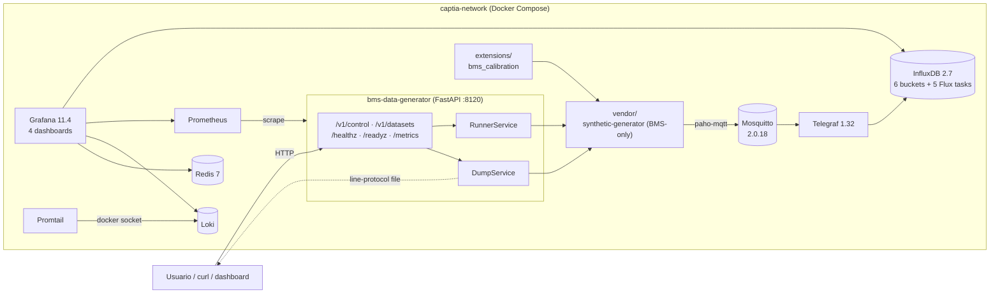
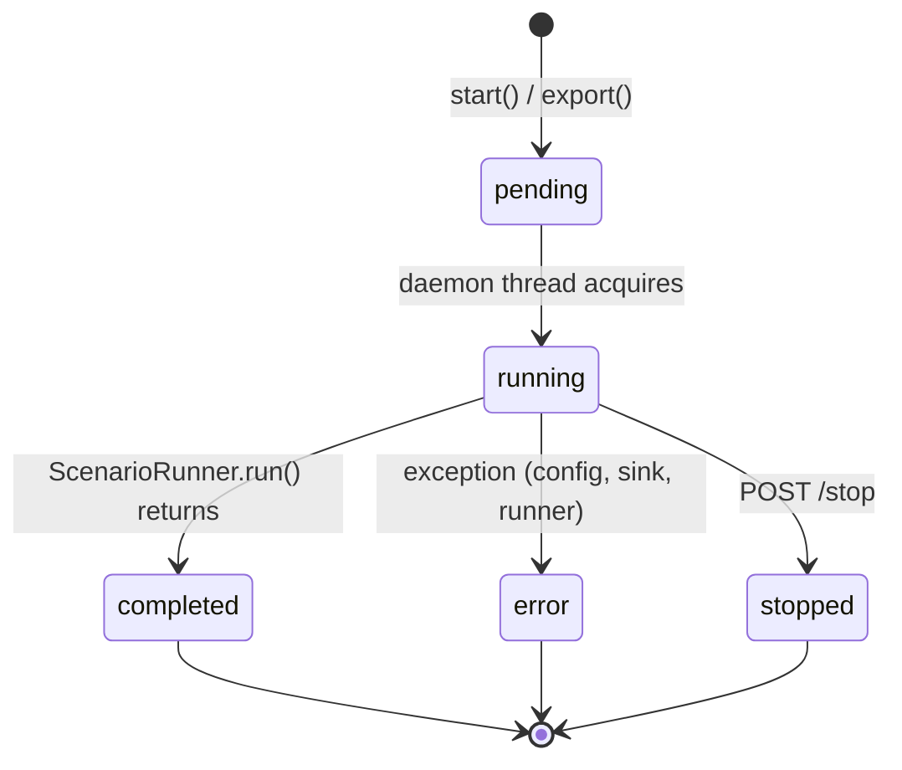
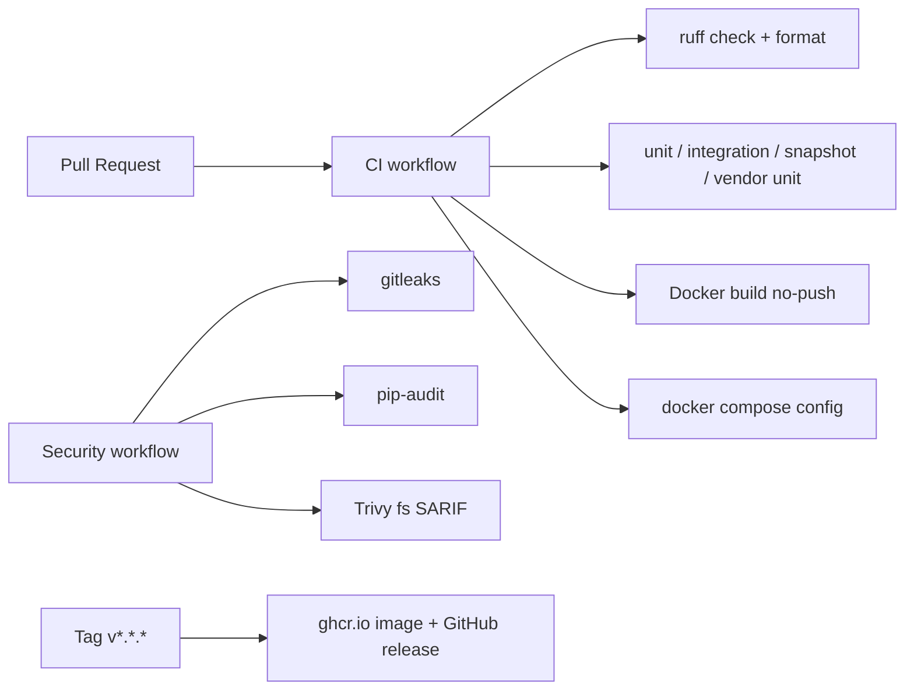

<div align="center">

# CAPTIA-SYNTHETIC-DATA-BMS

**Generador de datos sintéticos BMS (Building Management System) para CAPTIA**

Microservicio listo para producir 6–12 meses de telemetría sintética conforme al schema canónico CAPTIA, publicarla por MQTT a Telegraf → InfluxDB y visualizarla en Grafana — todo en un único `task quickstart`.

[](https://github.com/captia-technology/captia-synthetic-data-bms/actions/workflows/ci.yml)
[](https://github.com/captia-technology/captia-synthetic-data-bms/actions/workflows/security.yml)
[](https://www.python.org/)
[](https://fastapi.tiangolo.com/)
[](https://docs.docker.com/compose/)
[](https://www.influxdata.com/)
[](https://grafana.com/)
[](LICENSE)
[](CODE_OF_CONDUCT.md)
[](docs/specs/synthetic-bms/)
[](.pre-commit-config.yaml)

</div>

> **¿Qué es esto?** Una pieza autocontenida que genera telemetría realista de aulas educativas
> (CO₂, temperatura, humedad, ruido, ocupación, climatización, consumo) y la entrega exactamente
> con los topics MQTT, measurement y tags que usa CAPTIA-CONNECT en producción. Sirve para entrenar
> modelos de predicción de consumo, detección de anomalías HVAC, calidad de aire y como banco de
> pruebas del pipeline IoT entero.

---

## Índice

1. [TL;DR — diez segundos](#tldr--diez-segundos)
2. [Arquitectura](#arquitectura)
3. [Quickstart](#quickstart)
4. [Casos de uso](#casos-de-uso)
5. [API HTTP](#api-http)
6. [Schema canónico CAPTIA](#schema-canónico-captia)
7. [Stack y versiones](#stack-y-versiones)
8. [Configuración](#configuración)
9. [Comandos `task` / `make`](#comandos-task--make)
10. [Tests y calidad](#tests-y-calidad)
11. [Documentación y specs](#documentación-y-specs)
12. [FAQ](#faq)
13. [Contribuir](#contribuir)
14. [Licencia y soporte](#licencia-y-soporte)

---

## TL;DR — diez segundos

```bash
git clone https://github.com/captia-technology/captia-synthetic-data-bms.git
cd captia-synthetic-data-bms
task quickstart        # ó: make quickstart
```

Eso genera tu `.env` con secretos aleatorios, levanta los nueve contenedores, espera healthchecks,
ejecuta la suite smoke y te imprime las URL locales. Grafana queda en
http://localhost:3001 con `admin / admin`.

---

## Arquitectura



- **`vendor/synthetic-generator/`** — copia controlada del motor hexagonal interno de CAPTIA, recortada al dominio `bms_classrooms` (parche `001-bms-only.patch`).
- **`extensions/bms_calibration/`** — calendario lectivo de Valencia 2025-2026, inyector de cuatro tipos de fallos HVAC y hooks de calibración real.
- **`modules/bms-data-generator/`** — control plane FastAPI con jobs en threads daemon, métricas Prometheus y logs JSON.
- **`compose/` + `infra/`** — el stack docker reproducible.

Detalle completo en [`docs/specs/synthetic-bms/03-architecture-spec.md`](docs/specs/synthetic-bms/03-architecture-spec.md).

---

## Quickstart

### Requisitos

- Docker 24+ y Docker Compose v2
- [`uv`](https://github.com/astral-sh/uv) ≥ 0.5
- Python 3.12+ (lo instala `uv` si falta)
- [`task`](https://taskfile.dev) (Taskfile runner) o GNU Make

### Instalación reproducible

```bash
git clone https://github.com/captia-technology/captia-synthetic-data-bms.git
cd captia-synthetic-data-bms

task quickstart     # one-shot
# - genera .env con secretos aleatorios
# - uv sync
# - preflight (Docker, puertos, .env)
# - docker compose up -d
# - espera healthchecks (≤ 120 s)
# - smoke checks
# - imprime URLs útiles
```

### Acceso tras `quickstart`

| Servicio | URL local | Credenciales |
|----------|-----------|--------------|
| Generator API | http://localhost:8120 | Bearer `BMS_API_TOKEN` (en `.env`) |
| OpenAPI docs | http://localhost:8120/docs | — |
| Grafana | http://localhost:3001 | `admin` / `admin` |
| InfluxDB UI | http://localhost:8087 | `admin` / `INFLUXDB_ADMIN_PASSWORD` |
| Prometheus | http://localhost:9090 | — |
| Loki | http://localhost:3100/ready | — |
| MQTT (TCP) | `localhost:1884` | anonymous (dev) |
| MQTT (WebSocket) | `ws://localhost:9002` | anonymous (dev) |

> **Aviso seguridad** — todas las credenciales por defecto y `allow_anonymous true` de Mosquitto son **solo para desarrollo**. Antes de exponer el stack ver [`SECURITY.md`](SECURITY.md).

---

## Casos de uso

| Caso | Para qué | Comando | Salida |
|------|----------|---------|--------|
| **A — Pipeline IoT en vivo** | Ver el flujo MQTT → Telegraf → InfluxDB → Grafana en tiempo real | `curl -X POST http://localhost:8120/v1/control/start -H "Authorization: Bearer $BMS_API_TOKEN" -H 'content-type: application/json' -d '{"config_path":"/app/config/projects/bms_v1_demo.yaml","mode":"live","aulas":10,"faults":[]}'` | Datos en bucket `telemetry`, dashboards `bms_overview` y `bms_iaq_caseD` |
| **B — Predicción consumo 12 m** | 12 meses de `power_01`, `temperature_outdoor`, `solar_irradiance`, ocupación | `task dump:caseB` | `output/ies_simarro_12m_<job>.lp` (line-protocol importable con `influx write`) |
| **C — Anomalías HVAC** | 6 meses con etiquetas de fallo en bucket `state_events` | `task dump:caseC` | Dump con eventos `variable=fault.<tipo>` |
| **D — Calidad aire / ocupación** | 1 min de resolución para CO₂ → ocupación | `task dump:caseD` | `output/ies_simarro_3m_<job>.csv` |

Cada caso tiene su YAML en [`config/projects/`](config/projects/) y su dashboard en
[`infra/grafana/dashboards/`](infra/grafana/dashboards/).

---

## API HTTP

### Públicos

```http
GET /healthz   200  { "status": "ok", "version": "0.1.0", "uptime": 12.3 }
GET /readyz    200  cuando MQTT conectado y config cargada; 503 sino
GET /metrics   200  text/plain Prometheus
GET /docs      Swagger UI (deshabilitar si ENVIRONMENT=production)
```

### Control plane (`/v1/control`, Bearer)

```http
POST /v1/control/start   { config_path, mode: "live"|"backfill", aulas: 1..70, faults: [...] }
POST /v1/control/stop?job_id=...
GET  /v1/control/status?job_id=...
```

### Datasets (`/v1/datasets`, Bearer)

```http
POST /v1/datasets/export { months: 1..24, format: "line_protocol"|"csv_long", include_faults }
GET  /v1/datasets/jobs/{id}
```

Estados del job:



Ver [`docs/specs/synthetic-bms/06-api-and-ui-spec.md`](docs/specs/synthetic-bms/06-api-and-ui-spec.md).

---

## Schema canónico CAPTIA

Inmutable: las dashboards y queries de cualquier consumidor CAPTIA dependen de él.

```text
measurement : captia_point
field       : value (float; estados booleanos como 1.0 / 0.0)
tags (5)    : captia_env, domain_id, site_id, asset_id, variable
topic MQTT  : captia/{env}/{tenant}/{site}/{device}/telemetry/{name}
              captia/{env}/{tenant}/{site}/{device}/event/{name}
payload     : {"value": <float>, "ts_ns": <epoch_ns>}
```

| Bucket InfluxDB | Retención | Origen |
|-----------------|-----------|--------|
| `telemetry` | 14 d | live raw |
| `telemetry_1m` | 30 d | tarea Flux |
| `telemetry_15m` | 90 d | tarea Flux |
| `telemetry_1h` | 365 d | tarea Flux |
| `state_events` | 90 d | on-change dedup vía Telegraf statefile |
| `captia_metadata` | ∞ | catálogo de variables |

Verificación: `task smoke:schema` ejecuta queries Flux que confirman el contrato.

---

## Stack y versiones

| Servicio | Imagen | Puerto host |
|----------|--------|-------------|
| Mosquitto | `eclipse-mosquitto:2.0.18` | 1884 (MQTT), 9002 (WS) |
| Telegraf | `telegraf:1.32` | (interno :9273 metrics) |
| InfluxDB | `influxdb:2.7` | 8087 |
| Redis | `redis:7-alpine` | (interno) |
| Grafana | `grafana/grafana:11.4.0` (build local) | 3001 |
| Prometheus | `prom/prometheus:v2.49.1` | 9090 |
| Loki | `grafana/loki:2.9.4` | 3100 |
| Promtail | `grafana/promtail:2.9.4` | — |
| BMS Generator | Python 3.12 / FastAPI | 8120 |

Todas las imágenes están **pinned** a una versión exacta (no `latest`). Ver `compose/`.

---

## Configuración

Variables agrupadas por servicio en [`.env.example`](.env.example). Las críticas:

| Variable | Default | Para qué |
|----------|---------|----------|
| `BMS_API_TOKEN` | (generado por `task init:env`) | Bearer auth para `/v1/*` |
| `BMS_N_AULAS` | `10` | Número de aulas (`AULA01..AULA70`) |
| `BMS_SEED` | `42` | RNG determinista |
| `BMS_FAULTS_ENABLED` | `false` | Activa la inyección de fallos HVAC |
| `INFLUXDB_TOKEN` | (generado) | Token admin InfluxDB |
| `GRAFANA_ADMIN_PASSWORD` | `admin` | **Cambiar antes de exponer** |
| `MQTT_PORT_HOST` | `1884` | Puerto host del broker MQTT |
| `BMS_GENERATOR_PORT_HOST` | `8120` | Puerto host del API |

`task init:env` genera secretos aleatorios y crea `.env`. `task init:env:force` lo regenera.

---

## Comandos `task` / `make`

```text
task quickstart          # one-shot bootstrap completo
task urls                # imprime URLs locales
task install             # uv sync workspace
task lint                # ruff check + format check
task format              # ruff format
task test                # pytest -m unit
task test:integration    # pytest -m integration
task test:snapshot       # pytest -m snapshot (determinismo seed=42)
task up / down / clean   # docker compose up -d / down / down -v
task wait:healthy        # bloquea hasta healthy o 120 s timeout
task ps / logs           # estado / tail logs (SERVICE=<name> opcional)
task smoke               # mqtt + influx + grafana + schema canónico
task dump:caseB|C|D      # exports de los 3 casos backfill
task vendor:update       # re-vendor synthetic-generator (maintainers)
task config:render       # docker compose config (rendered)
```

Para usuarios sin `task`: el `Makefile` envuelve los targets más comunes (`make quickstart`, `make test`, `make up`, …).

---

## Tests y calidad

- **Unit + integration in-process**: `task test` y `task test:integration`. 46 tests pasan en < 1 s gracias a un *fake runner* inyectable (sin tocar el motor pesado).
- **Snapshot determinismo**: `task test:snapshot`. Hash sha256 fijo del `FaultInjector` con `seed=42` (`extensions/bms_calibration/tests/test_determinism.py`).
- **Vendor unit tests**: `uv run pytest vendor/synthetic-generator/tests/unit -q --override-ini="markers="`. 129 tests heredados.
- **Smoke E2E** (post `task up`): `task test:smoke` valida `/healthz`, MQTT publish, query Influx, Grafana.

CI ejecuta lint, los cuatro niveles de test, build Docker, validación compose y un escaneo `gitleaks` + `pip-audit` + `Trivy fs` (`.github/workflows/`). `pre-commit` con ruff, gitleaks y markdownlint en local.



---

## Documentación y specs

Spec-driven development en [`docs/specs/synthetic-bms/`](docs/specs/synthetic-bms/):

| Spec | Contenido |
|------|-----------|
| `00-research-report.md` | Mapa de fuentes y patrones detectados |
| `00-open-questions.md` | Lagunas detectadas y su estado |
| `00-repo-map.md` | Árbol target y de referencia |
| `01-product-spec.md` | Goal, casos de uso, criterios de aceptación |
| `02-domain-spec.md` | Entidades, variables, calendario, modelo de fallos |
| `03-architecture-spec.md` | Diagramas, reglas de import, flujos |
| `04-infra-spec.md` | Compose, healthchecks, volúmenes, redes |
| `05-observability-spec.md` | Métricas, logs, dashboards, alertas |
| `06-api-and-ui-spec.md` | Endpoints, auth, errores, OpenAPI |
| `07-testing-spec.md` | Pirámide, fixtures, validaciones |
| `08-task-plan.md` | Trazabilidad spec → tarea → test |
| `09-decision-log.md` | ADRs |
| `10-validation-checklist.md` | Checklist final por categoría |
| `STATUS.md` | Estado actual del proyecto |

Documentos fuente del dominio en `docs/`:
[`CAPTIA_Informe_CasosDeUso_DatosSinteticos.md`](docs/CAPTIA_Informe_CasosDeUso_DatosSinteticos.md),
[`CENTINELA_Guia_Alumnos_v4.md`](docs/CENTINELA_Guia_Alumnos_v4.md) y
[`MEDALLION_Arquitectura_Guia_Referencia.md`](docs/MEDALLION_Arquitectura_Guia_Referencia.md).

---

## FAQ

<details>
<summary><b>¿Es BMS = Battery Management System?</b></summary>

No. Aquí BMS = **Building Management System** (gateway de aula educativa). El dominio es `bms_classrooms` y los assets son `AULA01..AULA70` del IES Simarro.
</details>

<details>
<summary><b>¿Por qué hay un directorio <code>vendor/</code> en lugar de un git submodule?</b></summary>

Porque la decisión técnica registrada (ADR-001) prioriza control sobre el upstream y la posibilidad de aplicar parches reproducibles vía `vendor/synthetic-generator/PATCHES/`. El upstream `synthetic-generator` es interno y se re-vendora con `task vendor:update` (requiere `CAPTIA_CONNECT_PATH`).
</details>

<details>
<summary><b>¿Por qué Mosquitto admite conexiones anónimas?</b></summary>

Solo en desarrollo. `infra/mosquitto/mosquitto.conf` lo marca explícitamente como dev-only. Antes de cualquier despliegue ver el hardening checklist en [`SECURITY.md`](SECURITY.md).
</details>

<details>
<summary><b>¿Puedo añadir un nuevo dominio (ej. <code>bms_offices</code>)?</b></summary>

Sí, sin tocar `vendor/`. Crea un nuevo paquete bajo `extensions/` con un plugin que implemente `synthetic_generator.ports.domain.DomainAdapterPort` y registra el dominio con `@register_domain`. Añade un YAML de scenario en `config/projects/`. Spec relevante: `02-domain-spec.md`.
</details>

<details>
<summary><b>¿Tests usan el runner real?</b></summary>

Las suites unit/integration usan un `_FakeRunner` inyectado vía `runner_factory` para mantenerlas instantáneas. Los tests E2E bajo `tests/e2e/` se ejecutan contra el stack levantado y por defecto sólo en local (marker `slow`).
</details>

<details>
<summary><b>¿Cómo escalo más allá de 10 aulas?</b></summary>

`BMS_N_AULAS` admite hasta 70. Para volúmenes mayores ajusta también `mem_limit` / `cpus` del contenedor en `compose/generator.yaml` y baja `freq` del scenario YAML según el tipo de carga (5 s vs 1 min vs 5 min).
</details>

---

## Contribuir

PRs y issues son bienvenidos. Antes de empezar lee:

- [`CONTRIBUTING.md`](CONTRIBUTING.md) — workflow spec-driven, layout, convenciones.
- [`CODE_OF_CONDUCT.md`](CODE_OF_CONDUCT.md) — Contributor Covenant 2.1.
- [`SECURITY.md`](SECURITY.md) — política de divulgación de vulnerabilidades.

Stack local listo en una línea: `task quickstart`. Para añadir hooks pre-commit:
`pip install pre-commit && pre-commit install`.

---

## Licencia y soporte

- Licencia: [Apache License 2.0](LICENSE) — © 2026 CAPTIA Technology. Atribución en [`NOTICE`](NOTICE).
- Issues: <https://github.com/captia-technology/captia-synthetic-data-bms/issues>
- Contacto / divulgación responsable: **jaime.sendra@captiatechnology.com**
- Más información: <https://captiatechnology.com>

> *Hecho con `uv`, FastAPI, NumPy, Pandas, paho-mqtt y mucho café del IES Simarro.*
