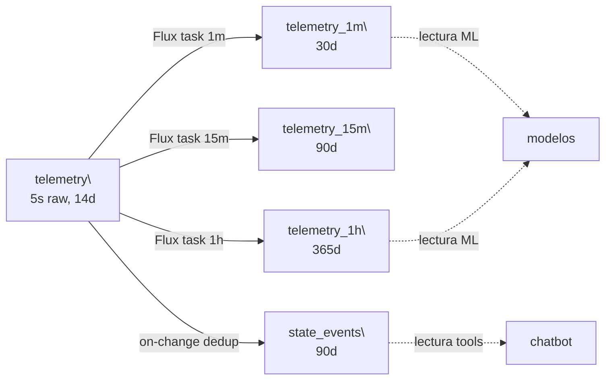

# Schema canónico CAPTIA — vista de arquitectura

> **Última verificación:** 2026-05-10
> **Detalle por tag y bucket:** [`contracts/influx-schema.md`](../contracts/influx-schema.md).

## Por qué un solo measurement

Tener un único measurement (`captia_point`) y usar el tag `variable` para
identificar la magnitud:

- Mantiene **cardinalidad baja** (un measurement, no docenas).
- Permite añadir variables sin cambiar el schema.
- Simplifica las queries Flux (filtrar por `variable=="co2"`).
- Aplica el principio "un solo punto de cambio" — si añades una nueva
  variable, basta con poblar `captia_point_meta`.

## Por qué un solo field

Tener `value` (float) único:

- Telegraf parsea sin ambigüedad.
- Estados booleanos como `0.0` / `1.0`.
- InfluxDB rechaza tipos mixtos en el mismo field — esto previene errores.

## Por qué 5 tags y no más

Cardinalidad dominante:

- `captia_env` (3) × `domain_id` (5) × `site_id` (~10) × `asset_id` (~70)
  × `variable` (24) ≈ **2.5 M series** posibles. En la práctica: 22 var ×
  10 aulas × 1 site = **220 series activas**.
- Añadir un sexto tag con cardinalidad alta puede multiplicar las series
  por 10–100, saturando el TSDB.

## Por qué etiquetas de fallo separadas

`captia_fault_labels` es un **measurement diferente** dentro del mismo
bucket `state_events`. Razones:

- No contamina `captia_point` con tags adicionales (`fault_type`).
- Permite consultas eficientes:
  `from(bucket:"state_events") |> filter(fn:(r)=>r._measurement=="captia_fault_labels")`.
- Cumple el principio "telemetría limpia + labels separadas" alineado con
  prácticas estándar de detección de anomalías.

## Topology de buckets y rollups

## Política de retención

Diseñada para balancear costo y casos de uso:

- **`telemetry` 14 d** — alertas tiempo real, debug.
- **`telemetry_1m` 30 d** — dashboards minutados.
- **`telemetry_15m` 90 d** — auditorías mensuales.
- **`telemetry_1h` 365 d** — el más usado por ML.
- **`state_events` 90 d** — eventos discretos.
- **`captia_metadata` ∞** — catálogo nunca expira.

## Validación operacional

Suite tests + `scripts/verify_canonical_schema.sh`. Suite total
**211/211 PASS**.
