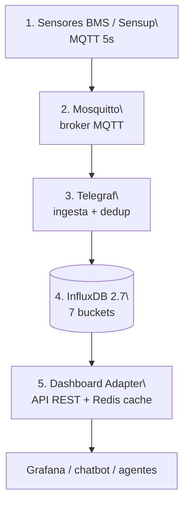

# CENTINELA+ — visión general

> **Última verificación:** 2026-05-10
> **Material original:** `docs/archive/CENTINELA_Guia_Alumnos_v4.md`.

CENTINELA+ es la plataforma de monitorización de edificios desarrollada por
CAPTIA Technology. Está desplegada físicamente en un edge server del IES
Simarro (`100.102.212.105`) en una OT LAN.

## Las 5 capas



## Sensores

| Tipo | Variables | Frecuencia |
|---|---|---|
| Gateway BMS | T, RH, CO₂, t-VOC, IAQ, ruido, lux, ocupación, power, AC, fan, válvulas | 5 s |
| Sensup ambiental | 9 variables redundantes | 5 s |

## Topics y payload

```
captia/{env}/{tenant}/{site}/{device}/telemetry/{variable}
{"value": <float>, "ts_ns": <epoch_ns>}
```

QoS 1, sin retain. Telegraf escribe paralelamente a buffer local.

## Routing por `metric_kind`

| metric_kind | Bucket | Stats |
|---|---|---|
| analog_gauge | telemetry | mean, min, max |
| bool_presence | telemetry | duty, count_rise, last |
| counter | telemetry | sum (delta) |
| bool_state | state_events | last, count_rise |
| setpoint_step | state_events | last |

## Buckets

7 buckets en este repo: `telemetry`, `_1m`, `_15m`, `_1h`, `state_events`,
`telemetry_events`, `captia_metadata`. Ver
[`docs/contracts/influx-schema.md`](../contracts/influx-schema.md).

## Aprovechar CENTINELA+ desde el proyecto

- **Caso A** reproduce localmente el pipeline completo.
- **Casos B-J** producen capa plata equivalente y modelos compatibles.
- **Caso F** versiona artefactos para que sean reproducibles en producción.

Cuando los sensores físicos estén disponibles, **el cambio para conectar
es solo `INFLUXDB_*` en `.env`**.
