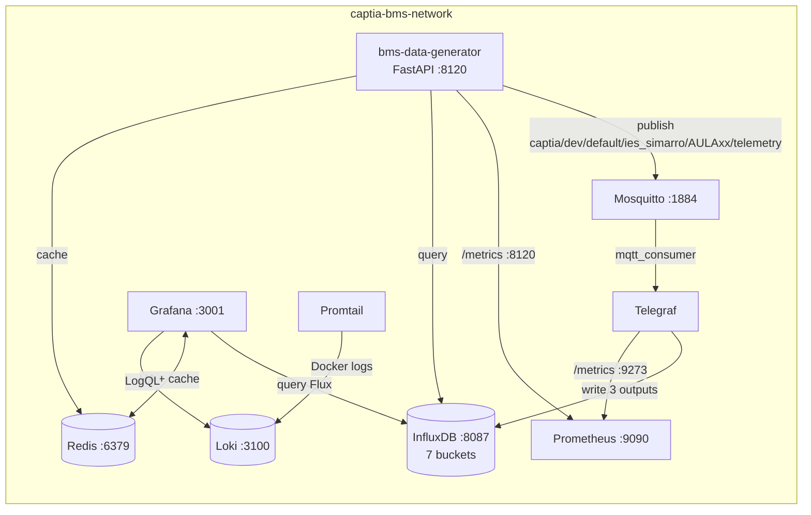
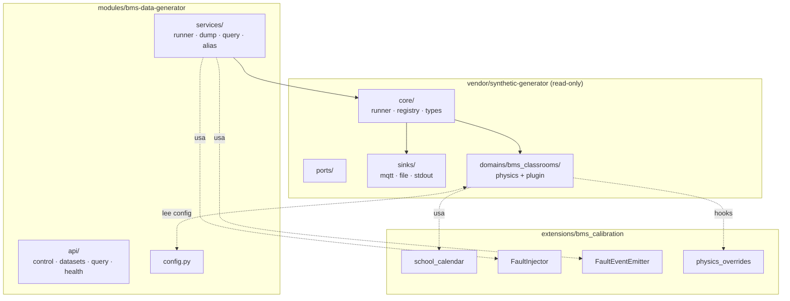

# Arquitectura — Visión general

> **Última verificación:** 2026-05-10
> **Fuente de verdad:** `docs/specs/synthetic-bms/03-architecture-spec.md`.

## Diagrama de contexto

## Capas internas del microservicio

## Reglas de import

- `vendor/synthetic-generator/core/` **no** importa `domains/`, `sinks/` ni `extensions/`.
- `extensions/bms_calibration/` **no** importa `vendor/.../sinks/` ni `vendor/.../physics/`.
- `modules/bms-data-generator/services/` orquesta `vendor` + `extensions` vía la API pública (registry, ports).
- Los tres paquetes son miembros de un único `pyproject.toml` workspace (`uv sync` los instala juntos).

## Flujos de datos principales

### Caso A — Pipeline IoT en vivo

1. `POST /v1/control/start { mode: "live", aulas: 10 }` → 202 `{ job_id }`.
2. `RunnerService` arranca un thread con `vendor.runner.ScenarioRunner(config)`.
3. Para cada timestamp (5 s):
   - `bms_classrooms.simulate()` produce `DataPoint`.
   - `extensions.faults` (si activo) inyecta fallos según probabilidad.
   - `vendor.sinks.MQTTSinkAdapter` publica a Mosquitto.
4. Telegraf consume MQTT, parsea topic con `processors.regex` (5 tags), escribe `captia_point` en InfluxDB.
5. Tareas Flux downsample → `telemetry_1m → telemetry_15m → telemetry_1h`.
6. Grafana queries → muestra dashboard.

### Caso B — Backfill + dump

1. `POST /v1/datasets/export { months: 12, format: "line_protocol" }` → 202 `{ job_id, output_path }`.
2. `DumpService` ejecuta backfill 365 días con `freq=5min`.
3. `vendor.sinks.FileSinkAdapter` escribe `output/{site_id}_12m.lp`.
4. Compresión gz + checksum sha256.

## Detalles por servicio

| Servicio | Doc | Healthcheck |
|---|---|---|
| `mosquitto` | [`infra/mosquitto/`](https://github.com/captiatechnology/CAPTIA-SYNTHETIC-DATA-BMS/tree/main/infra/mosquitto) | `mosquitto_sub` 1 mensaje |
| `telegraf` | [`infra/telegraf/`](https://github.com/captiatechnology/CAPTIA-SYNTHETIC-DATA-BMS/tree/main/infra/telegraf) | `pgrep telegraf` |
| `influxdb` | [`infra/influxdb/`](https://github.com/captiatechnology/CAPTIA-SYNTHETIC-DATA-BMS/tree/main/infra/influxdb) | `curl /health` |
| `redis` | [`compose/base.yaml`](https://github.com/captiatechnology/CAPTIA-SYNTHETIC-DATA-BMS/blob/main/compose/base.yaml) | `redis-cli ping` |
| `grafana` | [`infra/grafana/`](https://github.com/captiatechnology/CAPTIA-SYNTHETIC-DATA-BMS/tree/main/infra/grafana) | `curl /api/health` |
| `prometheus` | [`infra/prometheus/`](https://github.com/captiatechnology/CAPTIA-SYNTHETIC-DATA-BMS/tree/main/infra/prometheus) | `wget /-/healthy` |
| `loki` | [`infra/loki/`](https://github.com/captiatechnology/CAPTIA-SYNTHETIC-DATA-BMS/tree/main/infra/loki) | `wget /ready` |

## Recursos
- [Decisiones técnicas (ADRs)](../decisions/index.md)
- [Reporte de auditoría top 20](../audit/AUDIT_REPORT.md)
- [Validación E2E](../audit/E2E_VALIDATION_REPORT.md)
