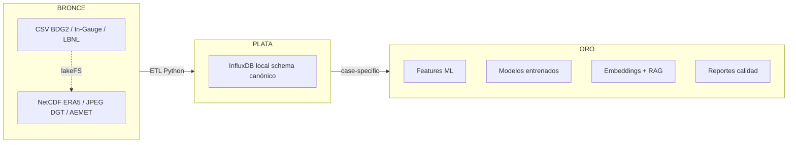

# Arquitectura Medallion aplicada al proyecto

> **Última verificación:** 2026-05-10
> **Material original:** `docs/archive/MEDALLION_Arquitectura_Guia_Referencia.md`.

## Visión



## Comparación entre capas

| Capa | Contenido | Características | Quién lo usa |
|---|---|---|---|
| Bronce | Datos crudos en su formato original | inmutables, pueden tener errores | ETL |
| Plata | Schema canónico CAPTIA | unidades SI, tags consistentes, timestamps UTC | modelos, dashboards |
| Oro | Datasets / modelos para casos de uso | features ML, embeddings, agregaciones | producción, reportes |

## CAPTIA como capa plata

CENTINELA+ ya resolvió el paso bronce→plata para sensores reales. El
InfluxDB de `simarro-prod` no es bronce, es **plata**: los datos llegan
ya estructurados con `captia_point` + 5 tags. Por eso este repo replica
ese mismo schema en local y los modelos entrenados aquí son reutilizables
con datos reales sin reescribir código.

## Variantes

1. **Estricto** — todo centralizado.
2. **Distribuido** — cada equipo gestiona su stack.
3. **Híbrido** — distribuido + consolidación final (elegida).
4. **Con dump de arranque** — depende de CAPTIA proporcionar el dump.

## Reglas

- Bronce **inmutable**: si algo falla en plata, vuelves a bronce.
- Plata **canónica**: sin tags fuera de los 5; ver
  [`contracts/influx-schema.md`](../contracts/influx-schema.md).
- Oro **case-specific**: vive cerca del modelo y se versiona.

## Caso A — el único que recorre todo el medallion

```
Dataset CSV  →  Script Python  →  Mosquitto  →  Telegraf  →  InfluxDB
   bronce        simula sensor      broker      pipeline      plata
```

El resto de equipos puede saltarse Mosquitto y Telegraf y escribir
directamente en plata.

## Más

- [`docs/contracts/medallion-layers.md`](../contracts/medallion-layers.md)
  — qué se permite en cada capa.
- [`notebooks/00_project_overview/00_arquitectura_medallion_captia.ipynb`](https://github.com/captia-technology/CAPTIA-SYNTHETIC-DATA-BMS/blob/main/notebooks/00_project_overview/00_arquitectura_medallion_captia.ipynb)
  — recorrido visual.
