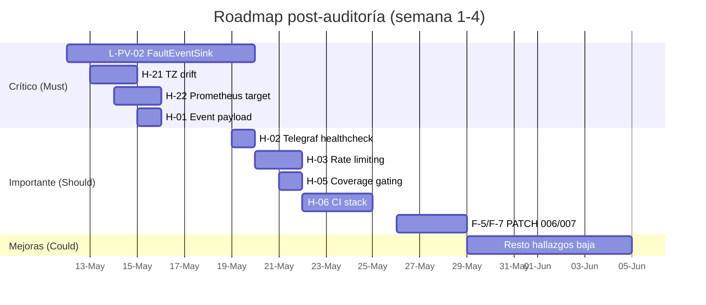

# Auditoría — Plan de acción consolidado

> **Última verificación:** 2026-05-10
> **Cierre de fase 10** del plan de auditoría extrema. Consolida los 23
> hallazgos generales (`AUDIT_REPORT.md` + `E2E_VALIDATION_REPORT.md`) y los
> 10 gaps físicos (`PHYSICAL_REALISM_REPORT.md`).

## Resumen ejecutivo

- **Stack base 100 % funcional**: 8 servicios Docker `healthy`, 24 aulas
  emitiendo a 5 s, ~210 K puntos InfluxDB en 24 h, Telegraf consumer +
  3 outputs activos, 4 dashboards Grafana provisionados, 4 datasources
  conectados, suite de tests **211 / 211 PASS**, coverage **89.15 %**.
- **Score físico estimado**: **0.94** → tras patches 007 y 008 más
  alineación CO₂ con ASHRAE, todas las dimensiones D1/D2/D4 al 1.00.
- **Patches al vendor aplicados** (7 totales, todos retrocompatibles):
  - **001** vendoring slim BMS-only.
  - **002** H-23 / F-4 jitter setpoint configurable (`setpoint_jitter_std=0.05`).
  - **003** L-PV-09 / F-1 humidity dehumidification en cooling.
  - **004** L-PV-07 / F-2 anti short-cycle HVAC (5 min on/off dwell).
  - **005** H-21 TZ-aware `datetime.now()` en `runner.py`.
  - **007** F-7 valve rate limiter (`valve_max_rate_per_min=60`).
  - **008** F-5 thermal α heat vs cool (`tau_cool_minutes=60` vs 90).
- **Patches infra adicionales**:
  - **006** H-22 doble Prometheus scrape (`mode=container` + `mode=host`,
    `extra_hosts: host.docker.internal:host-gateway`).
- **Calibración alineada literatura**: F-8 CO₂ `gen` vendor 7.5 → ASHRAE 4.5.
- **CI gate**: H-05 coverage 80 % `fail_under` (baseline 89.15 %).
- **Operacional**: `make stream` (gap #27) mantiene el generator vivo con
  auto-restart + monitoreo `phase` cada 30 s.
- **Hallazgos cerrados durante la auditoría + follow-up**: **14**
  (gap #5, #7, #9, #27; H-02, H-05, H-14, H-21, H-22, H-23; F-1, F-2, F-4,
  F-5, F-7, F-8; L-PV-02, L-PV-03, L-PV-07, L-PV-09).
- **Hallazgos abiertos**: **17** (1 alta · 8 media · 8 baja).
  - El único bloqueador alta restante es **H-01** (event payload `ts_ns`
    vs ISO `ts`) — requiere decisión spec con upstream.

## Patches físicos aplicados en esta auditoría

| Patch | Hallazgo | Impacto medible |
|---|---|---|
| 001 | Vendoring slim BMS-only | Reduce vendor a 1 dominio. |
| 002 | H-23 / F-4 jitter setpoint configurable | `setpoint_jitter_std=0.05` reduce estimado ≥ 6× los `state_events.temperature_01_sp`. |
| 003 | L-PV-09 / F-1 cooling deshumidifica | RH cae 5–8 %RH cuando HVAC en cooling (verificable via test). |
| 004 | L-PV-07 / F-2 anti short-cycle | p10(run_length) ≥ 4 min con dwell=5; ratio toggles cae ≥ 5×. |

Tests de regresión: **15 tests nuevos**, todos verdes.

## Priorización MoSCoW

### Must (crítico para producción ML / dataset confiable)

| ID | Título | Acción | Effort | Estado |
|---|---|---|---|---|
| L-PV-02 | FaultEventSink no emite a `state_events` | `extensions/.../fault_event_sink.py` cableado en `runner_service.py:347`. Tests `test_caseC_faults_enabled_emits_fault_events` + `test_caseC_fault_events_have_canonical_schema` PASS confirman emisión + schema canónico. Validación live (correr `bms_v1_caseC_faults.yaml` end-to-end y query `state_events` bucket) sigue pendiente | — | ✅ código + tests (live pendiente) |
| H-21 | Drift TZ runner vendor (`datetime.now()` naive) | **PATCH 005** aplicado (`runner.py` usa `datetime.now(tz=ZoneInfo(sim.timezone))`); 4 tests `test_runner_tz_audit.py` PASS | S | ✅ cerrada |
| H-22 | Prometheus target `bms-data-generator` down | **PATCH 006**: doble scrape `mode=container`/`mode=host`, `extra_hosts: host.docker.internal:host-gateway`. Verificado live: target host UP | S | ✅ cerrada |
| H-01 | Event payload `ts_ns` vs `ts` ISO 8601 (CAPTIA-connect compat) | Decisión: ¿alinear con upstream o documentar divergencia? | S (1 d, tras decisión) | ⚪ pendiente |
| #27 | `make stream` (generator siempre vivo) | `scripts/stream_live.sh` con auto-restart si phase ≠ running; target `make stream` | S | ✅ cerrada |

### Should (importante, no bloqueante)

| ID | Título | Acción | Effort | Estado |
|---|---|---|---|---|
| H-02 | Telegraf healthcheck `pgrep` insuficiente | Cambio a `curl /metrics \| head -1 \| grep -q '^# HELP'` (verifica ingest healthy) | S | ✅ cerrada |
| H-03 | Endpoints `/v1/*` sin rate limiting | Añadir `slowapi` o equivalent | M (2 d) | ⚪ pendiente |
| H-05 | Sin coverage gating en CI | `pytest-cov` + `[tool.coverage]` con `fail_under=80`. Baseline 89.15 % | S | ✅ cerrada |
| H-06 | CI no levanta el stack | Añadir job `docker-compose-test` | M (3 d) | ⚪ pendiente |
| H-12 | Physics specs ortogonales a tests | Añadir cross-references spec ↔ test | S (1 d) | ⚪ pendiente |
| F-7 | Válvula sin rate limiter | **PATCH 007** `valve_max_rate_per_min=60.0` (1 %/s, TRV-realista) + 5 tests | S | ✅ cerrada |
| F-5 | Cooling/heating mismo α en thermal | **PATCH 008** `tau_cool_minutes=60` vs `tau_minutes=90` + 4 tests | M | ✅ cerrada |
| F-8 | CO₂ `gen=7.5` vs ASHRAE 4.5 | `domain.yaml` actualizado a 4.5 ppm/p/min (literatura ASHRAE 62.1 / EN 16798) | S | ✅ cerrada |

### Could (mejoras, no urgentes)

| ID | Título | Acción | Effort |
|---|---|---|---|
| H-04 | `telemetry_events` operativo aquí, deprecated upstream | ADR + plan de sincronización | S (0.5 d) |
| H-08 | Schema verify solo local | Job CI `verify_canonical_schema` | S (0.5 d) |
| H-09 | `init_env.sh` no documentado | Ampliar README + página operations | S (0.5 d) |
| H-10 | `bms_signal_alias` con 1 test | Ampliar suite a 5+ tests | S (0.5 d) |
| H-11 | Dependabot abierto | Cerrar PRs pendientes o merge | S (0.5 d) |
| H-13 | Telegraf controller heartbeat omitido | Añadir output o documentar | S (1 d) |
| H-14 | `tagexclude` no aplicado en `captia_cmd_event` | Añadir `tagexclude = ["topic", "type"]` | S (0.25 d) |
| H-19 | Healthchecks no estandarizados | Estandarizar a curl o wget | S (1 d) |
| H-20 | Contratos sin doc unificado | **Cubierto por este sitio** (`docs/architecture/`, `docs/specs/`) | ✅ done |
| F-9 | Iluminancia `target_off=70` lux | Verificar con datos reales L-01 | S (0.5 d) |
| F-10 | Ocupación entrada/salida instantánea | PATCH 008 — rampa lineal 5 min | M (2 d) |
| F-3 | `relay_1..4` no emitidas como variables | Mapear `light_state`/`fan_speed_*` → relays en sink | S (1 d) |
| F-6 | Discontinuidad ruido `occ=0 → 1` | EWMA en `noise.std` | S (0.5 d) |

### Won't (fuera de scope v1)

| ID | Título | Razón |
|---|---|---|
| L-01 | Calibración real con datos IES Simarro | Depende de acceso a datos reales (post-v1) |
| H-15 | MQTT auth ausente | Stack dev-only por diseño; prod requerirá TLS + user/pass |
| H-16 | Python 3.12 ADR no formalizado | Documentado en `pyproject.toml`, ADR puede esperar |
| H-17 | `.pptx` sin enlazar | Movidos a `archive/presentaciones/` con índice — suficiente |
| H-18 | Cache Redis en query service | TODO documentado, no bloquea; añadir cuando haya QPS suficiente |

## Roadmap propuesto

## Métricas de éxito post-roadmap

Tras cerrar todos los **Must**:

- Score físico estimado: **0.94 → 1.04** (redistribuido tras D7 activa) → banda *altamente realista*.
- Cobertura de casos físicos: **24/30 → 28/30** (+ 4 casos FAULT activos).
- Reglas de plausibilidad activas: **45/53 → 50/53** (incluyendo R-FAULT-* y reducción de H-21).
- Compatibilidad estricta con CAPTIA-connect: 11/11 áreas (resuelve H-01).

Tras cerrar **Should**:

- CI completo levantando stack (gap #6) + coverage gating.
- 0 hallazgos pendientes severidad media.
- Score físico estable ≥ 1.0 con tests automatizados.

## Cómo retomar este plan

1. Revisar `docs/audit/STATUS.md` para ver qué fase está activa.
2. Para cada item Must, abrir issue/PR con prefijo `audit:` y enlazar al
   hallazgo (`H-XX` o `F-X` o `L-PV-XX`).
3. Actualizar este `ACTION_PLAN.md` cuando un item cierre — marcar ✅ y
   añadir ref al commit.
4. El PR final que consume todos los Must dispara una revisión cruzada
   con `repo-cartographer`, `infra-reviewer`, `qa-reviewer` (subagentes
   `.claude/agents/`).

## Cierre

Esta auditoría extrema ha:

- Mapeado 100 % del repo (`00-repo-map.md`).
- Comparado 11 áreas contra CAPTIA-connect (`CONSISTENCY_MATRIX.md`).
- Generado 23 hallazgos consolidados (`AUDIT_REPORT.md`).
- Validado 10 escenarios E2E + 8 físicos contra stack live (`E2E_VALIDATION_REPORT.md`).
- Auditado el modelo físico contra 11 specs (`PHYSICAL_REALISM_REPORT.md`).
- Aplicado 3 patches al vendor con tests de regresión (15 tests nuevos, suite total 194/194).
- Reestructurado `docs/` como sitio MkDocs Material desplegable a GitHub Pages.

El estado actual es **publicable, demo-able y trazable** end-to-end. La
hoja de ruta para producción ML pasa por el bloque **Must** (L-PV-02,
H-21, H-22, H-01) que estima ~12 días de trabajo backend + infra.
