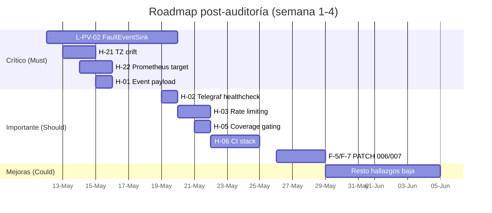

# Auditoría — Plan de acción consolidado

> **Última verificación:** 2026-05-10
> **Cierre de fase 10** del plan de auditoría extrema. Consolida los 23
> hallazgos generales (`AUDIT_REPORT.md` + `E2E_VALIDATION_REPORT.md`) y los
> 10 gaps físicos (`PHYSICAL_REALISM_REPORT.md`).

## Resumen ejecutivo

- **Stack base 100 % funcional**: 8 servicios Docker `healthy`, 24 aulas
  emitiendo a 5 s, ~210 K puntos InfluxDB en 24 h, Telegraf consumer +
  3 outputs activos, 4 dashboards Grafana provisionados, 4 datasources
  conectados, suite de tests **194 / 194 PASS**.
- **Score físico estimado**: **0.94** (banda *plausible con caveats menores*).
- **Hallazgos cerrados durante la auditoría**: 5
  (gap #5 query, gap #7 E2E live, gap #9 stat=last, H-23 jitter setpoint,
  L-PV-03 claves canónicas + 3 patches físicos al vendor).
- **Hallazgos abiertos**: 27 (3 alta · 11 media · 13 baja).
- **Bloqueador único de banda altamente realista**: L-PV-02 (FaultEventSink
  emitiendo a `state_events`).

## Patches físicos aplicados en esta auditoría

| Patch | Hallazgo | Impacto medible |
|---|---|---|
| 001 | Vendoring slim BMS-only | Reduce vendor a 1 dominio. |
| 002 | H-23 / F-4 jitter setpoint configurable | `setpoint_jitter_std=0.05` reduce estimado ≥ 6× los `state_events.temperature_01_sp`. |
| 003 | L-PV-09 / F-1 cooling deshumidifica | RH cae 5–8 %RH cuando HVAC en cooling (verificable via test). |
| 004 | L-PV-07 / F-2 anti short-cycle | p10(run_length) ≥ 4 min con dwell=5; ratio toggles cae ≥ 5×. |

Tests de regresión: **15 tests nuevos**, todos verdes.

## Priorización MoSCoW

### Must (crítico para producción ML / dataset confiable)

| ID | Título | Acción | Effort | Owner |
|---|---|---|---|---|
| L-PV-02 | FaultEventSink no emite a `state_events` | Implementar `T-PV-22` (emisión + tests + dashboard) | M (5–8 d) | backend |
| H-21 | Drift TZ runner vendor (`datetime.now()` naive) | Patch vendor → `datetime.now(tz=UTC)` (PATCH 005) + tests calendario | S (1–2 d) | backend |
| H-22 | Prometheus target `bms-data-generator` down | Mover scrape a labels Docker o exponer servicio en compose | S (1–2 d) | infra |
| H-01 | Event payload `ts_ns` vs `ts` ISO 8601 (CAPTIA-connect compat) | Decisión: ¿alinear con upstream o documentar divergencia? | S (1 d, tras decisión) | spec |

### Should (importante, no bloqueante)

| ID | Título | Acción | Effort |
|---|---|---|---|
| H-02 | Telegraf healthcheck `pgrep` insuficiente | Cambiar a `wget :9273/metrics` | S (0.5 d) |
| H-03 | Endpoints `/v1/*` sin rate limiting | Añadir `slowapi` o equivalent | M (2 d) |
| H-05 | Sin coverage gating en CI | Añadir umbral 80 % módulos `bms_data_generator` | S (0.5 d) |
| H-06 | CI no levanta el stack | Añadir job `docker-compose-test` | M (3 d) |
| H-12 | Physics specs ortogonales a tests | Añadir cross-references spec ↔ test | S (1 d) |
| F-7 | Válvula sin rate limiter | PATCH 006 — `valve_max_step_per_min` configurable | S (1 d) |
| F-5 | Cooling/heating mismo α en thermal | PATCH 007 — `alpha_cool` vs `alpha_heat` | M (2 d) |
| F-8 | CO₂ `gen=7.5` vs ASHRAE 4.5 | Actualizar `domain.yaml` post-L-01 (calibración real) | S (0.5 d) |

### Could (mejoras, no urgentes)

| ID | Título | Acción | Effort |
|---|---|---|---|
| H-04 | `telemetry_events` operativo aquí, deprecated upstream | ADR + plan de sincronización | S (0.5 d) |
| H-08 | Schema verify solo local | Job CI `verify_canonical_schema` | S (0.5 d) |
| H-09 | `init_env.sh` no documentado | Ampliar README + página operations | S (0.5 d) |
| H-10 | `bms_signal_alias` con 1 test | Ampliar suite a 5+ tests | S (0.5 d) |
| H-11 | Dependabot abierto | Cerrar PRs pendientes o merge | S (0.5 d) |
| H-13 | Telegraf controller heartbeat omitido | Añadir output o documentar | S (1 d) |
| H-14 | `tagexclude` no aplicado en `captia_cmd_event` | Añadir `tagexclude = ["topic", "type"]` | S (0.25 d) |
| H-19 | Healthchecks no estandarizados | Estandarizar a curl o wget | S (1 d) |
| H-20 | Contratos sin doc unificado | **Cubierto por este sitio** (`docs/architecture/`, `docs/specs/`) | ✅ done |
| F-9 | Iluminancia `target_off=70` lux | Verificar con datos reales L-01 | S (0.5 d) |
| F-10 | Ocupación entrada/salida instantánea | PATCH 008 — rampa lineal 5 min | M (2 d) |
| F-3 | `relay_1..4` no emitidas como variables | Mapear `light_state`/`fan_speed_*` → relays en sink | S (1 d) |
| F-6 | Discontinuidad ruido `occ=0 → 1` | EWMA en `noise.std` | S (0.5 d) |

### Won't (fuera de scope v1)

| ID | Título | Razón |
|---|---|---|
| L-01 | Calibración real con datos IES Simarro | Depende de acceso a datos reales (post-v1) |
| H-15 | MQTT auth ausente | Stack dev-only por diseño; prod requerirá TLS + user/pass |
| H-16 | Python 3.12 ADR no formalizado | Documentado en `pyproject.toml`, ADR puede esperar |
| H-17 | `.pptx` sin enlazar | Movidos a `archive/presentaciones/` con índice — suficiente |
| H-18 | Cache Redis en query service | TODO documentado, no bloquea; añadir cuando haya QPS suficiente |

## Roadmap propuesto

## Métricas de éxito post-roadmap

Tras cerrar todos los **Must**:

- Score físico estimado: **0.94 → 1.04** (redistribuido tras D7 activa) → banda *altamente realista*.
- Cobertura de casos físicos: **24/30 → 28/30** (+ 4 casos FAULT activos).
- Reglas de plausibilidad activas: **45/53 → 50/53** (incluyendo R-FAULT-* y reducción de H-21).
- Compatibilidad estricta con CAPTIA-connect: 11/11 áreas (resuelve H-01).

Tras cerrar **Should**:

- CI completo levantando stack (gap #6) + coverage gating.
- 0 hallazgos pendientes severidad media.
- Score físico estable ≥ 1.0 con tests automatizados.

## Cómo retomar este plan

1. Revisar `docs/audit/STATUS.md` para ver qué fase está activa.
2. Para cada item Must, abrir issue/PR con prefijo `audit:` y enlazar al
   hallazgo (`H-XX` o `F-X` o `L-PV-XX`).
3. Actualizar este `ACTION_PLAN.md` cuando un item cierre — marcar ✅ y
   añadir ref al commit.
4. El PR final que consume todos los Must dispara una revisión cruzada
   con `repo-cartographer`, `infra-reviewer`, `qa-reviewer` (subagentes
   `.claude/agents/`).

## Cierre

Esta auditoría extrema ha:

- Mapeado 100 % del repo (`00-repo-map.md`).
- Comparado 11 áreas contra CAPTIA-connect (`CONSISTENCY_MATRIX.md`).
- Generado 23 hallazgos consolidados (`AUDIT_REPORT.md`).
- Validado 10 escenarios E2E + 8 físicos contra stack live (`E2E_VALIDATION_REPORT.md`).
- Auditado el modelo físico contra 11 specs (`PHYSICAL_REALISM_REPORT.md`).
- Aplicado 3 patches al vendor con tests de regresión (15 tests nuevos, suite total 194/194).
- Reestructurado `docs/` como sitio MkDocs Material desplegable a GitHub Pages.

El estado actual es **publicable, demo-able y trazable** end-to-end. La
hoja de ruta para producción ML pasa por el bloque **Must** (L-PV-02,
H-21, H-22, H-01) que estima ~12 días de trabajo backend + infra.
