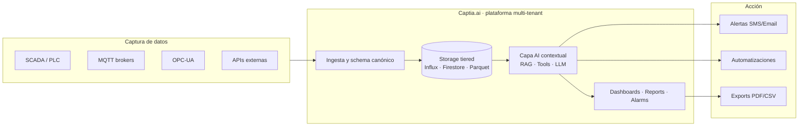

# Sobre CAPTIA Technology

  

  <strong>Plataforma AI-first de análisis de datos industriales y energéticos.</strong>

> Multi-tenant · Tiempo real · Dashboards interactivos · Informes automáticos · Automatizaciones · IA contextual

---

## Qué somos

**CAPTIA Technology** es una empresa española especializada en plataformas de
inteligencia artificial aplicadas al análisis de datos industriales y
energéticos en tiempo real. Operamos desde la Comunidad Valenciana con foco en:

- **Edificación inteligente** (BMS — *Building Management Systems*).
- **Energía** (predicción de consumo, detección de anomalías, optimización HVAC).
- **Industria 4.0** (SCADA, MES, alarmas ISA-18.2, mantenimiento predictivo).
- **Educación técnica** (alianzas con FP y universidades, banco de pruebas docente).

Nuestra plataforma **Captia.ai** ([captiatechnology.com](https://captiatechnology.com))
permite a empresas industriales:

- **Visualizar** datos de proceso en tiempo real (series temporales, SCADA).
- **Consultar** con IA contextual consumos, alarmas y tendencias.
- **Generar** informes automáticos en PDF.
- **Automatizar** alertas y acciones basadas en datos (workflow engine).
- **Gestionar** alarmas industriales con ciclo ISA-18.2 completo.
- **Gestionar** usuarios, roles y planes de suscripción (multi-tenant).

## Qué hacemos

## Productos y servicios

| Producto | Descripción | Audiencia |
|---|---|---|
| **Captia.ai** ([web](https://captiatechnology.com)) | Plataforma SaaS multi-tenant: SCADA + dashboards + alarmas ISA-18.2 + agentes IA | Empresas industriales y energéticas |
| **Captia-Connect** | Edge connector + canonical schema + observability completa | Integradores y partners |
| **Captia Synthetic Data BMS** (este repo) | Generador open-source de datos sintéticos para BMS docente y de investigación | FP, universidades, partners académicos |
| **Servicios profesionales** | Consultoría, integración, calibración, formación | Cualquier sector regulado |

## Por qué este repo importa

`CAPTIA Synthetic Data BMS` es la primera apertura **open-source bajo licencia
Apache 2.0** de un componente del ecosistema CAPTIA. Está diseñado para:

1. **Acelerar adopción académica** — alumnos de FP IES Simarro pueden trabajar
   con datos realistas sin restricciones GDPR ni dependencia de telemetría real.
2. **Demostrar el rigor técnico** de la suite CAPTIA — 10 patches físicos
   con tests de regresión, score de realismo 0.94, schema canónico inviolable.
3. **Atraer partners** académicos e industriales mediante un dataset
   reproducible bit-a-bit (`seed=42`).
4. **Crear tracción comercial** hacia los productos premium de CAPTIA
   (módulo F MLOps, módulo G Quality Agents, servicios profesionales).

## Estándares y compliance

| Estándar | Uso en este repo |
|---|---|
| **ASHRAE 62.1-2019** | Tasa CO₂ por persona (4.5 ppm/p/min) |
| **EN 16798-1:2019** | Calidad ambiental interior, modelo PMV |
| **EN ISO 13790** | Modelo térmico RC primer orden (τ=90 min aulas) |
| **ISA-18.2** | Ciclo de vida alarmas (en plataforma Captia.ai principal) |
| **Apache 2.0** | Licencia open-source de este repo |
| **GDPR** | 100 % datos sintéticos, sin PII |

## Contacto

- **Web corporativa**: [captiatechnology.com](https://captiatechnology.com)
- **Plataforma**: [captia.ai](https://captia.ai)
- **Maintainer técnico**: [Jaime Sendra](mailto:jaime.sendra@captiatechnology.com)
- **Repo**: [github.com/captia-technology/captia-synthetic-data-bms](https://github.com/captia-technology/captia-synthetic-data-bms)
- **Documentación**: [captia-technology.github.io/captia-synthetic-data-bms](https://captia-technology.github.io/captia-synthetic-data-bms/)

---

> _CAPTIA Technology — datos sintéticos rigurosos para inteligencia artificial
> aplicada a edificación inteligente, energía industrial y educación técnica._
