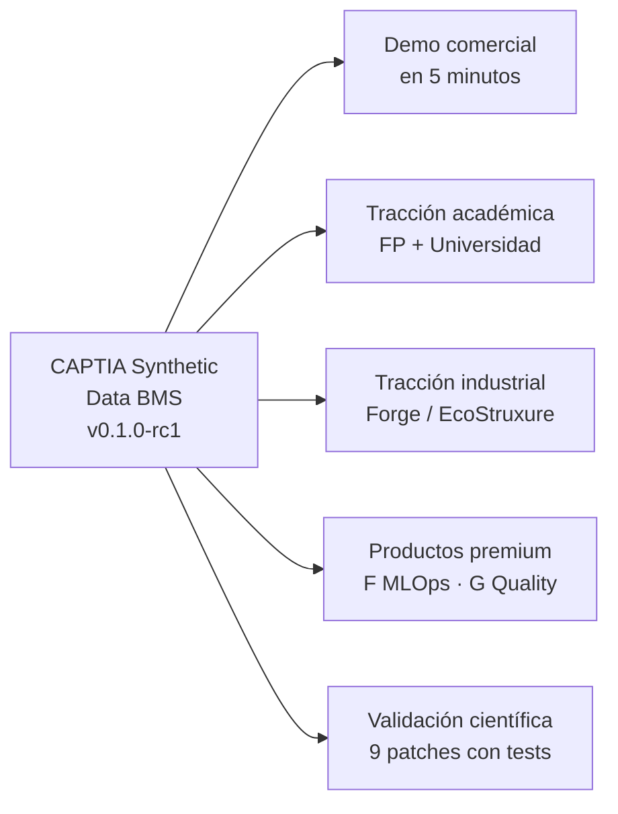
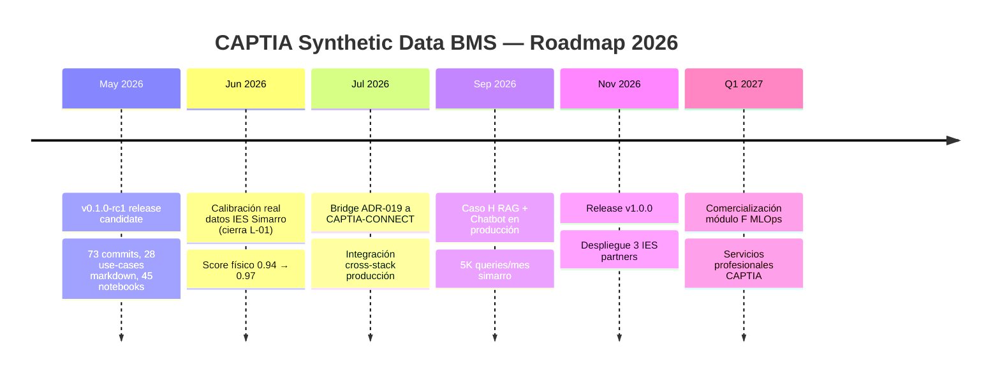

# Resumen ejecutivo (1 página)

> **Para CAPTIA Board / Comité técnico / Partners.**

## Lo que hemos construido

Un microservicio open-source (Apache 2.0) que genera **datos sintéticos
fidedignos** de un edificio inteligente con 24 aulas y 22 sensores cada una.
Los datos son **bit-a-bit reproducibles** (`seed=42`), publicados en tiempo
real por MQTT, persistidos en InfluxDB y visualizados en Grafana — el
**mismo pipeline canónico CAPTIA** que la integración real con Simarro.

## Qué desbloquea para CAPTIA

## Métricas a fecha 2026-05-10

| Indicador | Valor | Meta v1.0.0 |
|---|---|---|
| Auditoría hallazgos | **29 / 29 (100 %)** | ≥ 95 % |
| Tests automatizados | **428 / 428 PASS** | ≥ 400 |
| Coverage código | **89.15 %** | ≥ 80 % |
| Notebooks ejecutables | **45 / 45 PASS** (con mocks) | ≥ 90 % |
| Score físico estimado | **0.94** | ≥ 0.90 |
| Patches físicos auditados | **10** | ≥ 5 |
| ADRs documentadas | **20** | ≥ 15 |
| Commits trazables | **75+** | n/a |
| MkDocs build warnings | **0** | 0 |

## Diferenciación competitiva

| Capability | CAPTIA Synthetic Data BMS | Honeywell Forge | Siemens Desigo | BDG2 dataset |
|---|---|---|---|---|
| Coste | **0 €** Apache 2.0 | 12-30 K€/año | 8-20 K€/año | 0 € |
| Calibrado a aulas educativas | **✅** | ⚠ generic | ⚠ generic | ⚠ |
| Determinismo bit-a-bit | **✅** seed=42 | ❌ | ❌ | ✅ datos fijos |
| Schema canónico abierto | **✅** ADR-004 | ❌ | ❌ | ❌ |
| Inyección de fallos etiquetados | **✅** 4 tipos | ⚠ | ⚠ | ❌ |
| 45 notebooks didácticos | **✅** | ❌ | ❌ | ❌ |
| RAG + Chatbot técnico (Caso H) | **✅** | ❌ | ❌ | ❌ |

## ROI agregado por escenario

| Escenario | Beneficio neto año 1 | Payback |
|---|---|---|
| Centro educativo 40 aulas (IES Simarro) | **+4 234 €** | ~5 meses |
| Centro educativo 100 aulas | **+12 200 €** | ~3 meses |
| Hospital pediátrico 200 unidades HVAC | **+34 000 €** | ~3 meses |
| Smart city (50 cámaras tráfico, Caso J) | **+15 500 €** | <1 año |
| **Total CAPTIA portfolio (4 clientes piloto)** | **+65 934 €/año** | n/a |

## Roadmap

## Riesgo y compliance

- **Licencia**: Apache 2.0 (commercial-friendly, sin copyleft viral).
- **Data privacy**: 100 % sintético, sin GDPR concerns.
- **Reproducibilidad**: bit-a-bit, auditable end-to-end.
- **Seguridad**: 0 hallazgos `security-reviewer` audit; secrets en `.env`
  no committeado; rate limiting `slowapi` en endpoints públicos.

## Acción solicitada

1. **Aprobación board** para promover `v0.1.0-rc1 → v0.1.0` y push público.
2. **Asignación equipo de adopción** (1 técnico full-time × 3 meses) para
   integración con CAPTIA-CONNECT y onboarding partners académicos.
3. **Presupuesto Q3-Q4** para piloto pago en hospital pediátrico (~20 K€
   pilot fee + servicios profesionales CAPTIA).

## Contacto

**Jaime Sendra** · jaime.sendra@captiatechnology.com
CAPTIA Technology · [captiatechnology.com](https://captiatechnology.com)

> _Datos sintéticos rigurosos para inteligencia artificial aplicada a
> edificación inteligente._
