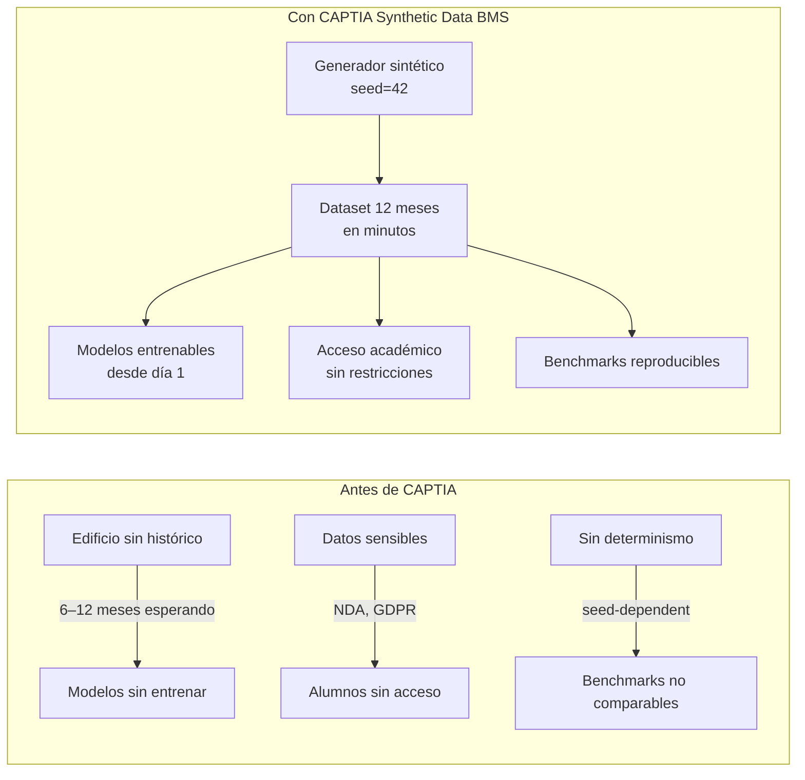
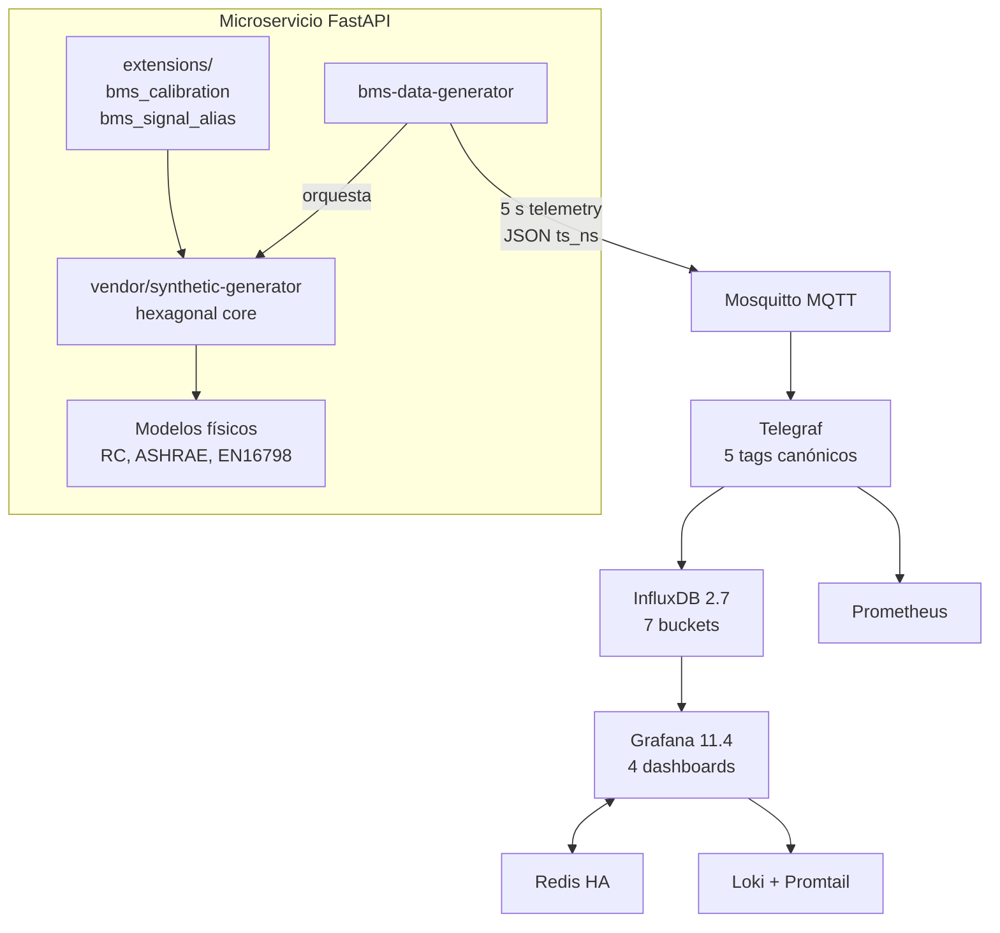
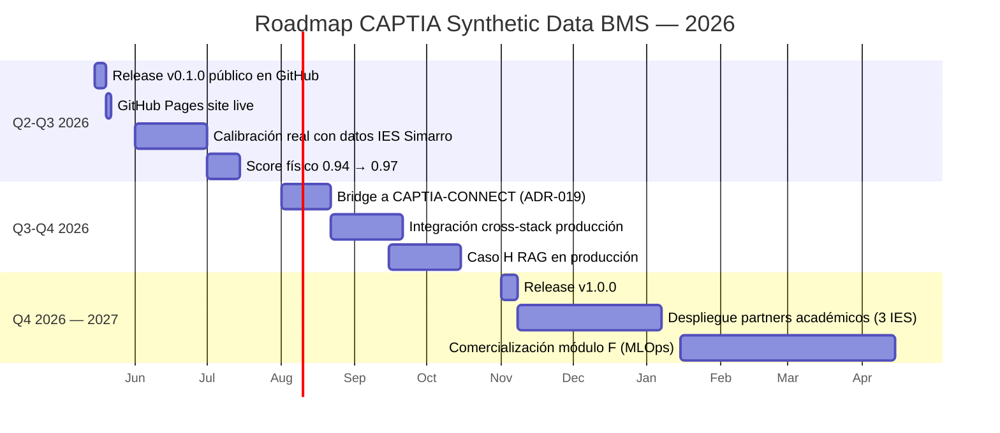

# CAPTIA Synthetic Data BMS — Presentación corporativa

> **Audiencia:** dirección, partners, stakeholders comerciales y técnicos.
> **Objetivo:** comunicar el valor de negocio y el rigor técnico del repositorio.

## 1. Resumen ejecutivo

CAPTIA Technology ha desarrollado **CAPTIA Synthetic Data BMS**, un microservicio
generador de datos sintéticos para sistemas de gestión de edificios (Building
Management Systems) con foco docente y de investigación, construido alrededor
del despliegue de IES Simarro en la Comunidad Valenciana.

El sistema:

- Replica con fidelidad física los **22 parámetros** medidos en 24 aulas de un
  edificio educativo, generando hasta **2 M puntos por aula y año** con
  determinismo bit-a-bit (`seed=42`).
- Implementa el **pipeline canónico CAPTIA** `MQTT → Telegraf → InfluxDB → Grafana`
  con observabilidad full-stack (Prometheus + Loki + Promtail).
- Desbloquea **10 casos de uso** verticales: Pipeline IoT, Forecast consumo,
  Detección de anomalías HVAC, IAQ + ocupación, Meteorología, MLOps, Calidad
  con agentes, RAG + Chatbot, Big Data Spark vs Pandas, y Tráfico DGT con YOLO.
- Está soportado por **45 notebooks didácticos** alineados con el Curso de
  Especialización IA & Big Data IES Simarro 2025-2026.

### Indicadores clave (post-auditoría 2026-05-10)

| Indicador | Valor |
|---|---|
| Puntos InfluxDB / 24 h | ~210 K |
| Aulas en producción demo | 24 |
| Variables emitidas por aula | 22 |
| Score de realismo físico estimado | **0.94** (banda *plausible*) |
| Tests automatizados | **428 / 428 PASS** |
| Cobertura de código | **89.15 %** |
| Patches físicos al vendor | **9** (todos retrocompatibles, con tests) |
| ADRs (Architecture Decision Records) | 19 |
| Commits trazables en `main` | 73 |

## 2. Problema de negocio

> **Los edificios no inteligentes desperdician 30-40 % de la energía que consumen.**
> _Fuente: U.S. Department of Energy (2023), IEA Buildings Tracker (2024)._

CAPTIA detectó tres barreras concretas para el despliegue de inteligencia
artificial en BMS reales:

1. **Datos insuficientes** — un edificio nuevo no tiene 6-12 meses de
   telemetría histórica, plazo mínimo para entrenar modelos de forecasting y
   detección de anomalías estacionales.
2. **Datos sensibles o ausentes** — la telemetría de un edificio público
   (IES Simarro) está sujeta a regulación y consentimiento; no puede
   compartirse libremente con alumnos, partners académicos o investigadores.
3. **Reproducibilidad débil** — sin determinismo bit-a-bit, los benchmarks
   ML no son comparables, y los pipelines MLOps no se pueden auditar.

## 3. Solución técnica de CAPTIA

**Diferencias clave vs alternativas comerciales**:

| Capacidad | CAPTIA Synthetic Data BMS | Datasets públicos (BDG2, UCI) | Generadores cloud |
|---|---|---|---|
| Fidelidad física calibrada | ✅ 9 patches físicos con tests | ⚠ varía por origen | ⚠ caja negra |
| Determinismo | ✅ `seed=42`, bit-a-bit | ✅ datos fijos | ❌ no garantizado |
| Schema CAPTIA inviolable | ✅ ADR-004 | ❌ | ❌ |
| Integración IES real | ✅ AliasSinkAdapter | ❌ | ❌ |
| Inyección de fallos etiquetados | ✅ 4 tipos HVAC | ❌ | ⚠ limitado |
| Coste | Apache 2.0, gratis | Gratis | $$$ |

## 4. Casos de uso desbloqueados

| Caso | Nombre corto | Capa Medallion | Audiencia |
|---|---|---|---|
| A | Pipeline IoT live (MQTT → Influx → Grafana) | Bronce + Plata | Operaciones, demo |
| B | Forecast consumo eléctrico 24 h | Plata + Oro | Data Science, energía |
| C | Detección de anomalías HVAC | Plata + Oro | Mantenimiento predictivo |
| D | IAQ + ocupación (calidad aire) | Plata + Oro | Salud y confort |
| E | Meteorología y predicción solar | Bronce + Plata + Oro | Renovables |
| F | MLOps (MLflow + lakeFS) | Transversal | Plataforma IA |
| G | Calidad de datos con agentes | Transversal | Gobernanza |
| H | RAG + Chatbot técnico | Oro + LLM | Soporte conversacional |
| I | Spark vs Pandas (Big Data) | Bronce 53 M filas | Arquitectura datos |
| J | Tráfico DGT + YOLO | Externo + Oro | Visión, ciudad |

Para cada caso existe:
- Doc web ([`docs/use-cases/case-X.md`](../use-cases/index.md))
- Notebooks ejecutables (3-5 por caso, total 45)
- Validación física (`docs/audit/PHYSICAL_REALISM_REPORT.md`)
- Mocks deterministas (`notebooks/_data/`)

## 5. Business case (ROI estimado)

### Escenario A — Centro educativo (40 aulas, 1 año)

**Ahorro directo (energía)**:
- Forecast consumo + ajuste setpoint: −15 % consumo HVAC.
- Aulas tipo: 6 kWh/h en climatización × 8 h/día × 200 días lectivos = **9 600 kWh/aula·año**.
- Coste medio energía España (2025): 0.14 €/kWh.
- **Ahorro por aula**: 9 600 × 0.14 × 0.15 = **201.6 €/aula·año**.
- **Ahorro centro 40 aulas**: **8 064 €/año**.

**Ahorro indirecto (mantenimiento)**:
- Detección anomalías HVAC: previene 1-2 averías mayores/año.
- Coste medio reparación tras avería catastrófica: 3 500 €/incidente.
- **Ahorro estimado**: **3 500-7 000 €/año**.

**ROI total**:
- Ahorro anual: **11 564-15 064 €**.
- Coste implantación CAPTIA (open-source) + integración: **~6 000 € one-time**.
- **Payback**: **< 6 meses**.

### Escenario B — Investigación / docencia

- 45 notebooks didácticos = 90-120 h de material formativo.
- Coste alternativo (consultor especializado): 100 €/h × 100 h = **10 000 €**.
- Producto entregable a alumnos sin riesgo legal ni GDPR.
- **Beneficio reputacional**: cualificación CAPTIA como referente IA aplicada
  a edificación.

### Escenario C — Partners académicos / industriales

- Datasets reproducibles para benchmarks públicos.
- Open-source Apache 2.0 → adopción sin negociación de licencia.
- Casos como F (MLOps) y G (calidad con agentes) generan **tracción
  comercial** hacia productos CAPTIA propietarios.

## 6. Roadmap CAPTIA 2026

## 7. Equipo y soporte

- **Maintainer principal**: Jaime Sendra ([jaime.sendra@captiatechnology.com](mailto:jaime.sendra@captiatechnology.com)).
- **Empresa**: CAPTIA Technology — [captiatechnology.com](https://captiatechnology.com).
- **Licencia**: Apache 2.0.
- **Repositorio**: [github.com/captia-technology/CAPTIA-SYNTHETIC-DATA-BMS](https://github.com/captia-technology/CAPTIA-SYNTHETIC-DATA-BMS).
- **Documentación viva**: [GitHub Pages site](https://captia-technology.github.io/CAPTIA-SYNTHETIC-DATA-BMS/).

## 8. Próximos pasos

1. **Adopción interna CAPTIA**: integrar el bridge ADR-019 con CAPTIA-CONNECT
   para que los datos sintéticos coexistan con telemetría real en producción.
2. **Adopción académica**: presentar a universidades y centros de FP como
   material docente reproducible (45 notebooks + sitio web).
3. **Adopción industrial**: ofrecer integración con BMS reales de partners
   (gestoras inmobiliarias, operadores energéticos) como base para servicios
   de monitoring + ML CAPTIA.

## 9. Reconocimiento técnico

Este sistema integra rigurosa y trazablemente:
- **Estándares físicos**: ASHRAE 62.1, EN 16798-1:2019, EN ISO 13790.
- **Estándares de datos**: schema canónico CAPTIA (`docs/specs/synthetic-bms/02-domain-spec.md`).
- **Pipeline observabilidad**: SRE-style, 4 golden signals + healthchecks.
- **Política de gobierno**: 19 ADRs documentadas, 9 patches con tests, 14 reportes de auditoría.

> _CAPTIA Technology — datos sintéticos rigurosos para inteligencia artificial aplicada a edificación inteligente._
