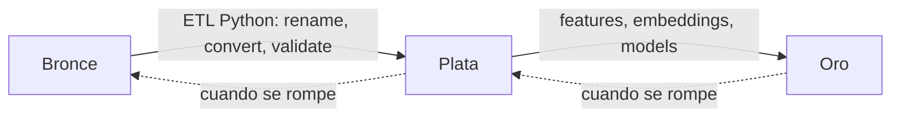

# Capas Medallion — qué se permite en cada una

> **Última verificación:** 2026-05-10
> **Fuente:** `docs/archive/MEDALLION_Arquitectura_Guia_Referencia.md`,
> `docs/architecture/medallion.md`.

## Bronce — datos en origen

**Permitido**:

- CSV, JSON, NetCDF, ZIP, JPEG en su formato original.
- Versionado con lakeFS / DVC / Delta.
- Conservar lo recibido aunque tenga errores, nulos o duplicados.

**Prohibido**:

- Modificar el contenido — bronce es **inmutable**.
- Cambiar nombres de columnas.
- Convertir unidades.

> Si algo sale mal en plata u oro, siempre se vuelve a bronce y se
> recompila.

## Plata — datos normalizados

**Permitido**:

- Schema canónico CAPTIA (`captia_point` + 5 tags + `value`).
- Unidades SI (°C, W, ppm, m/s, hPa).
- Timestamps UTC en ns epoch.
- Identificadores consistentes (`AULA01` = `AULA01` en todo el dataset).

**Prohibido**:

- Field distinto a `value`.
- Tags fuera de los 5 canónicos (excepción documentada: `stat` para rollups,
  `fault_type` para `captia_fault_labels`).
- Mezclar señales continuas y on-change en mismo bucket.
- Variables sin entrada en `captia_point_meta`.

## Oro — datos enriquecidos

**Permitido**:

- DataFrames pandas / parquet con features ML.
- Embeddings, índices ElasticSearch / FAISS.
- Modelos entrenados (joblib, ONNX, TensorFlow SavedModel).
- Reglas de calidad ejecutables.
- Datasets etiquetados específicos (Caso C `is_fault`).

**Prohibido**:

- Cambiar el contrato sin cerrar el ciclo (re-entrenar / re-evaluar).
- Sobrescribir oros viejos sin versionar (lakeFS tag).

## Trazabilidad obligatoria

Cada notebook lleva en su primera celda markdown:

```
> _Caso de uso: X · Capa Medallion: Y · Spec: docs/specs/.../...md_
```

donde `Y ∈ {bronce, bronce → plata, plata, oro, transversal}`.

## Cambios de capa (transformaciones permitidas)



Cualquier flecha en sentido contrario (oro → plata) viola la regla.

## Validaciones por capa

| Capa | Tooling | Notebook |
|---|---|---|
| Bronce | `pandera`-style + GE | `notebooks/07_case_G_data_quality_agents/01_*` |
| Plata | Flux + Python | `notebooks/07_*/02_*` |
| Oro | KL, balance, leakage | `notebooks/07_*/03_*` |
