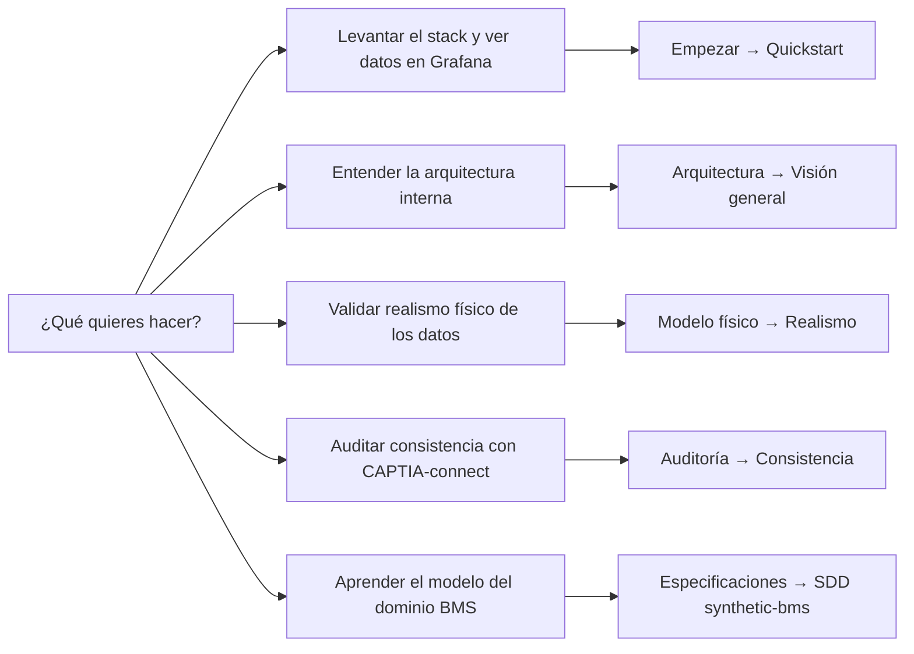
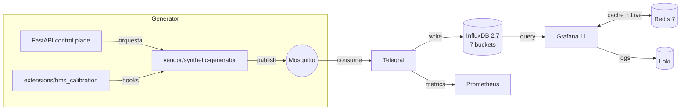

# CAPTIA Synthetic Data BMS

> **Última verificación:** 2026-05-10
> **Stack:** Python 3.12 · FastAPI · MQTT · InfluxDB 2.7 · Telegraf · Redis · Grafana 11 · Prometheus · Loki · Promtail
> **Licencia:** Apache 2.0
> **Contacto:** [jaime.sendra@captiatechnology.com](mailto:jaime.sendra@captiatechnology.com)

Microservicio generador de datos sintéticos para BMS (*Building Management
System*) en aulas educativas (IES Simarro, Comunidad Valenciana). Reproduce
el pipeline canónico CAPTIA `MQTT → Telegraf → InfluxDB → Grafana` con un
generador hexagonal vendoreado y políticas de extensión locales.

## ¿Qué quieres hacer?

## Mapa rápido por intención

| Quiero… | Sección | Tiempo |
|---|---|---|
| **Levantar el stack en local** y ver `make demo` funcionando | [Empezar → Quickstart](QUICKSTART.md) | ~5 min |
| **Entender qué hay en cada servicio** del compose | [Arquitectura → Visión general](architecture/index.md) | ~10 min |
| **Validar que el modelo físico es plausible** | [Modelo físico → Resumen](physical-model/index.md) | ~15 min |
| **Comparar contra CAPTIA-connect** upstream | [Auditoría → Consistencia](audit/CONSISTENCY_MATRIX.md) | ~10 min |
| **Saber qué tareas se han hecho y cuáles quedan** | [Auditoría → Estado](audit/STATUS.md) | ~5 min |
| **Entender por qué algo se hizo así** (decisiones) | [Decisiones → ADR](decisions/index.md) | ~10 min |
| **Resolver un problema operacional** | [Empezar → Troubleshooting](TROUBLESHOOTING.md) | depende |
| **Documentación histórica** (CENTINELA, MEDALLION, casos de uso) | [Archivo](archive/index.md) | referencia |

## Visión de alto nivel

## Estructura del repo

| Directorio | Propósito |
|---|---|
| `modules/bms-data-generator/` | Servicio FastAPI (control plane: `/v1/control`, `/v1/datasets`, `/v1/query`, `/healthz`, `/readyz`, `/metrics`). |
| `vendor/synthetic-generator/` | Generador hexagonal vendoreado (read-only); parches en `vendor/.../PATCHES/`. |
| `extensions/bms_calibration/` | Calendario lectivo Valencia, FaultInjector, FaultEventEmitter, hooks de física. |
| `compose/` | 4 archivos Docker Compose (`base`, `observability`, `generator`, `data-plane-init`). |
| `infra/` | Config de Mosquitto, Telegraf, InfluxDB (init scripts + Flux tasks), Redis, Grafana, Prometheus, Loki, Promtail. |
| `config/projects/` | 4 escenarios YAML (`bms_v1_demo`, `caseB_consumption`, `caseC_faults`, `caseD_iaq`). |
| `config/domains/bms_classrooms/` | Override del dominio (variables, faults, calendario, física calibrada). |
| `tests/` | Suite de auditoría (integration), 105+ tests sobre Telegraf, Flux, schemas, calendario, fault injection y patches físicos. |
| `docs/` | Esta documentación (MkDocs Material, GitHub Pages). |

## Estado actual de la auditoría

| Fase | Entregable | Estado |
|---|---|---|
| 1 | Mapa del repo (`audit/00-repo-map.md`) | ✅ |
| 2 | Matriz de consistencia BMS↔CAPTIA-connect | ✅ |
| 3 | Plan de reestructuración docs (este sitio) | ✅ |
| 4 | Reporte top 20 hallazgos (`audit/AUDIT_REPORT.md`) | ✅ |
| 5 | Validación E2E con stack live (`audit/E2E_VALIDATION_REPORT.md`) | ✅ |
| 6 | Realismo físico (`audit/PHYSICAL_REALISM_REPORT.md`) | ✅ |
| 7 | Correcciones mínimas trazables (3 patches al vendor) | ✅ |
| 8 | Reestructuración docs como sitio web (este sitio) | 🟡 en curso |
| 9 | GitHub Pages workflow | ⚪ pendiente |
| 10 | `ACTION_PLAN.md` final | ⚪ pendiente |

Trazabilidad: cada fase produce un commit con referencia explícita al hallazgo.

## Contratos clave (no negociables)

- **Topics MQTT**: `captia/{env}/{tenant}/{site}/{device}/telemetry/{name}` (telemetría) y `.../event/{name}` (eventos).
- **Schema InfluxDB**: `measurement = captia_point`, field `value` (float), 5 tags (`captia_env`, `domain_id`, `site_id`, `asset_id`, `variable`).
- **Buckets**: `telemetry` (14 d), `telemetry_1m` (30 d), `telemetry_15m` (90 d), `telemetry_1h` (365 d), `state_events` (90 d), `telemetry_events` (90 d), `captia_metadata` (∞).
- **Determinismo**: `seed=42` por defecto, `numpy.random.default_rng`.
- **Vendoring**: `vendor/synthetic-generator/` es read-only; las modificaciones se documentan en `PATCHES/NNN-titulo.patch` y se justifican en un ADR.
