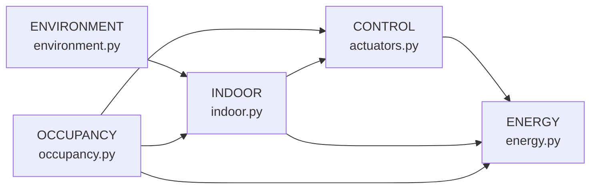

# Modelo físico — Resumen

> **Última verificación:** 2026-05-10
> **Fuente de verdad:** `docs/specs/digital-twin-bms-physics-validation/`.

## Resumen

| Métrica | Valor |
|---|---|
| Variables emitidas por aula | **21** (catálogo completo de 22 menos `iaq-index` derivado) |
| Reglas de plausibilidad documentadas | **53** |
| Reglas implementables hoy | **45** |
| Reglas bloqueadas (FaultEventSink) | **5** (familia FAULT) |
| Casos físicos definidos | **30** |
| Casos cubiertos por código | **24/30** (80 %) |
| **Score de realismo estimado** | **0.94** (banda *plausible con caveats menores*) |

Detalle, evidencias live y auditoría completa: [PHYSICAL_REALISM_REPORT](../audit/PHYSICAL_REALISM_REPORT.md).

## Familias de modelos

| Familia | Modelo | Constantes calibradas en `domain.yaml` |
|---|---|---|
| ENVIRONMENT | `outdoor_temperature` sinusoidal anual; `daylight_lux` coseno diario | `outdoor_temp.{mean_annual, amplitude, daily_noise_std}` |
| OCCUPANCY | Poisson(`capacity·util·p_slot·day_var`); PIR derivado | `schedule.{aula_capacity_*, aula_utilization_*, slots[*]}` |
| INDOOR | Tª RC 1er orden, CO₂ well-mixed, RH 1er orden con dehum (cool), ruido lineal por tramos, illuminance `max(daylight, target)` | `indoor.{tau_minutes, occupancy_heat_gain_c_per_person, setpoint_*}`, `co2.{outdoor_ppm, gen_ppm_per_min_per_person, vent_k_per_min, leak_k_per_min}`, `humidity.{outdoor_mean, occupancy_gain_per_person, tau_minutes, cooling_dehum_delta}`, `noise.*`, `light.*` |
| CONTROL | Setpoint con jitter (configurable), HVAC mode por umbral exterior, HVAC enable con anti short-cycle, válvula proporcional | `indoor.{setpoint_jitter_std, setpoint_manual_jitter_std, hvac_min_on_minutes, hvac_min_off_minutes}` |
| ENERGY | Aditivo `base + 180·light + 900·hvac + 8·occ + spikes_rare`; energía cumulativa | hardcoded |

## Patches físicos aplicados (correcciones trazables)

| Patch | Hallazgo | Cambio |
|---|---|---|
| **002** | H-23 jitter setpoint excesivo | `setpoint_jitter_std` configurable (0.05 default override) |
| **003** | L-PV-09 cooling no deshumidificaba | `simulate_humidity` recibe `hvac_enable + mode`; cooling resta `cooling_dehum_delta` (default 8 %RH) |
| **004** | L-PV-07 HVAC short-cycling | `_enforce_min_dwell` post-process (5 min on / 5 min off) |

Referencias literales: [`vendor/synthetic-generator/PATCHES/`](https://github.com/captiatechnology/CAPTIA-SYNTHETIC-DATA-BMS/tree/main/vendor/synthetic-generator/PATCHES).

## Determinismo

- `seed=42` por defecto en todos los escenarios (`config/projects/*.yaml`).
- `numpy.random.default_rng(seed)` se usa en todos los modelos (no `np.random.seed()` global).
- Snapshot test en `extensions/bms_calibration/tests/test_determinism.py` confirma reproducibilidad bit-a-bit del `FaultInjector` con seed fija.

## Validación periódica con queries Flux

Las 4 queries listadas en `audit/PHYSICAL_REALISM_REPORT.md#8-queries-flux-para-validación-periódica` permiten verificar live:

1. CO₂ correlaciona positivamente con ocupación.
2. Rangos físicos respetados (CO₂ ∈ [420, 2200], Tª ∈ [16, 32]).
3. Standby `< 110 W` con todo apagado.
4. Heartbeat dedup `state_events` (toda serie tuvo al menos un evento en 168 h).

## Lecturas recomendadas

- [PHYSICAL_REALISM_REPORT (auditoría)](../audit/PHYSICAL_REALISM_REPORT.md) — informe completo, top 10 gaps, evidencia live.
- `docs/specs/digital-twin-bms-physics-validation/01-observed-physical-model.md` — modelo físico observado.
- `docs/specs/digital-twin-bms-physics-validation/04-physical-plausibility-rules.md` — 53 reglas.
- `docs/specs/digital-twin-bms-physics-validation/08-physical-realism-score.md` — métrica del score.
