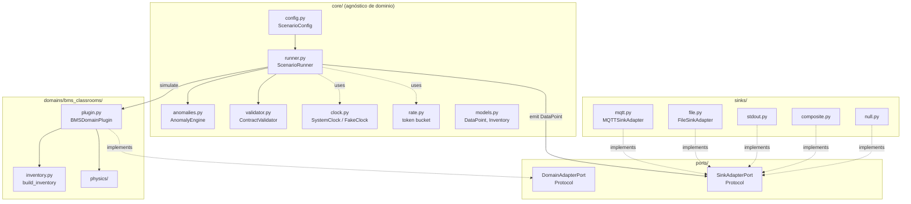
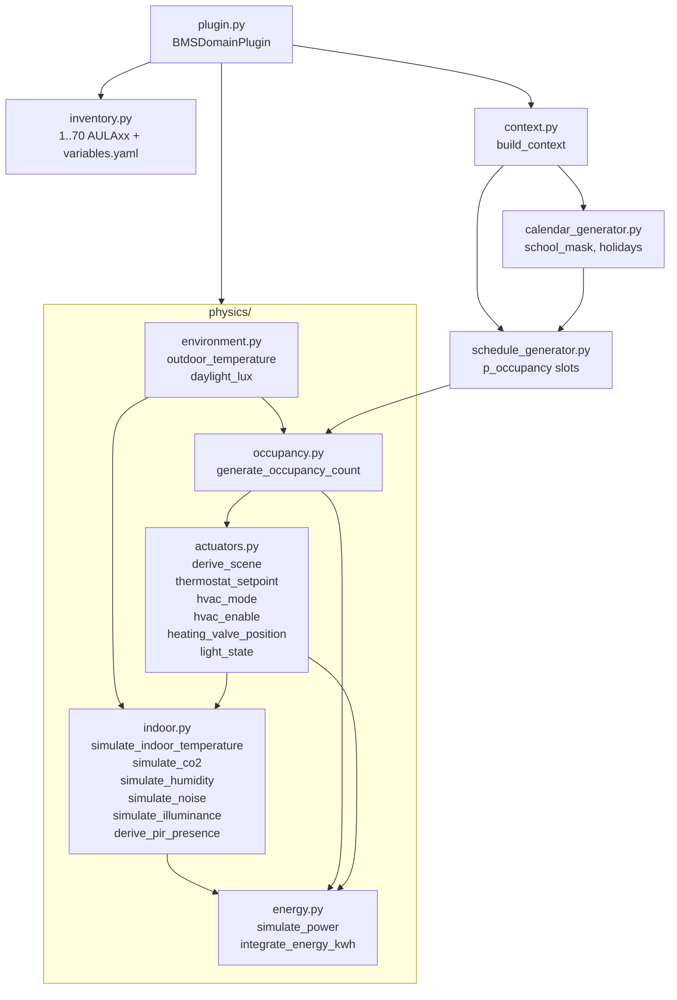
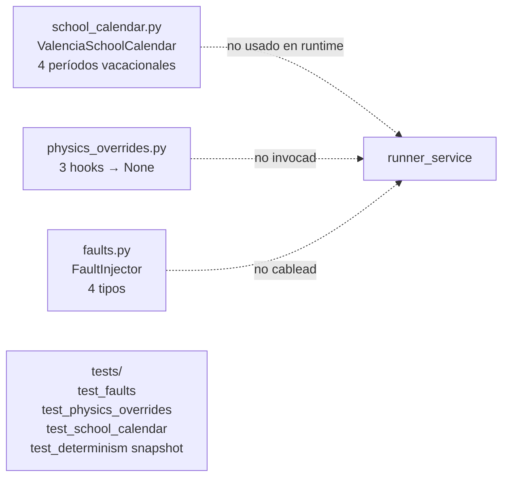
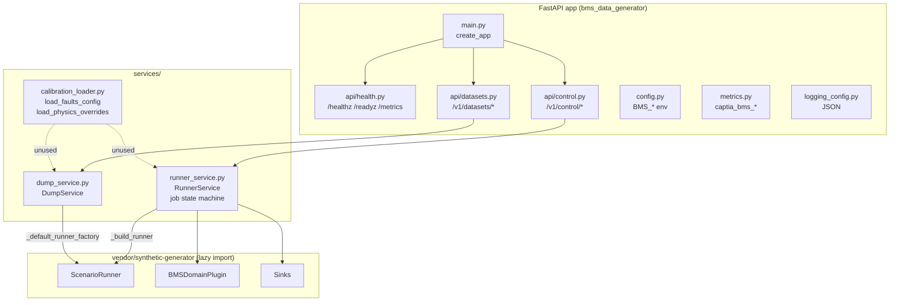
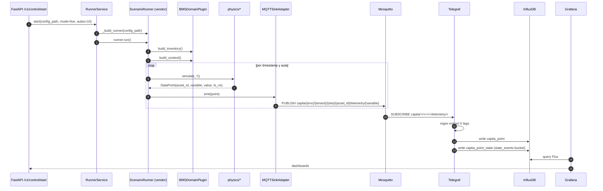

# 00 — Mapa estructural del generador (Fase 0)

## Contexto

Mapa de ingredientes y flujos del generador BMS, derivado de inspección de código. Sirve como diagrama de referencia para `07-validator-design.md` (dónde insertar el validador) y `09-physical-observability.md` (qué señales surfacear).

## Vista hexagonal — vendor `synthetic-generator`



## Plug-in BMS — `domains/bms_classrooms/`



### Orden de cómputo por aula

1. `outdoor_temperature(index, cfg, rng)` y `daylight_lux(index)` → contexto exterior (compartido entre aulas).
2. `school_mask(index, calendar)` → bool por timestamp.
3. `p_occupancy(index, schedule, school_mask)` → probabilidad por timestamp.
4. `sample_aula_parameters(rng_aula)` → `(capacity, util)` por aula.
5. `generate_occupancy_count(...)` → serie `occupancy`.
6. `derive_scene(occupancy, school_mask, rng)` → `scene_mode`.
7. `thermostat_setpoint(scene, cfg, rng)` → `thermostat_setpoint`.
8. `hvac_mode(outdoor_temp, rng)` → `hvac_mode`.
9. `simulate_indoor_temperature(outdoor_temp, occupancy, setpoint, hvac_enable_prev, ...)` → `temperature` (nota: `hvac_enable` aquí debe venir del paso anterior; el código lo resuelve iterando — ver 01).
10. `hvac_enable(temperature, setpoint, occupancy, scene)` → `hvac_enable`.
11. `heating_valve_position(temperature, setpoint, mode)` → `heating_valve_pos`.
12. `simulate_co2(occupancy, hvac_enable, cfg, rng)` → `co2`.
13. `simulate_humidity(outdoor_temp, occupancy, cfg, rng)` → `humidity`.
14. `derive_pir_presence(occupancy, rng)` → `presence_pir`.
15. `light_state(occupancy, daylight_lux, rng)` → `light_state` (no aparece en variables.yaml como tal, alimenta `illuminance` y `power`).
16. `simulate_illuminance(daylight_lux, light_state, cfg, rng)` → `illuminance`.
17. `simulate_noise(occupancy, cfg, rng)` → `noise`.
18. `simulate_power(occupancy, light_state, hvac_enable, rng)` → `power`.
19. `integrate_energy_kwh(power)` → `energy`.

> **Acoplamientos a verificar** (ver `02-physics-questions.md`): el orden anterior implica que `temperature` se calcula con `hvac_enable` del paso previo. La realimentación HVAC ↔ T_indoor es **lazy** (1 paso de retraso).

## Capa BMS — `extensions/bms_calibration/`



> **Estado**: estos 3 módulos son **inertes** en el path de generación actual. `runner_service._build_runner` no los importa. Solo los tests los ejercitan. Esta es una de las 3 deudas estructurales clave (ver `00-open-questions.md` L-PV-04, L-PV-05, L-PV-06).

## Capa servicio — `modules/bms-data-generator/`



## Pipeline de datos completo (Caso A — live)



## Sinks y schema canónico

```mermaid
flowchart LR
  subgraph DataPoint
    DP[asset_id<br/>variable<br/>value: float\|bool<br/>ts_ns: int<br/>quality: GOOD\|OUTLIER\|MISSING<br/>data_type<br/>point_type]
  end

  subgraph MQTT topic
    T[captia/{env}/{tenant}/{site}/{asset_id}/telemetry/{variable}]
  end

  subgraph Payload JSON
    P["value: float<br/>ts_ns: int"]
  end

  subgraph CAPTIA schema InfluxDB
    M[measurement: captia_point<br/>tags: captia_env, domain_id, site_id, asset_id, variable<br/>field: value]
  end

  DP -->|MQTTSink| T
  DP -->|MQTTSink| P
  T -->|Telegraf| M
  P -->|Telegraf| M
```

## Buckets InfluxDB (existentes — no se modifican)

| Bucket | Retención | Origen | Uso ML |
|--------|-----------|--------|--------|
| `telemetry` | 14 d | raw 5 s ingestion | alertas tiempo real |
| `telemetry_1m` | 30 d | downsample (mean/min/max) | corto plazo |
| `telemetry_15m` | 90 d | rollup | medio plazo |
| `telemetry_1h` | 365 d | rollup | **principal ML** |
| `state_events` | 90 d | on-change (boolean, setpoint, fault) | clasificación de eventos |
| `captia_metadata` | ∞ | catálogo (unit, range, metric_kind) | referencia |

> **Propuesta para validación física** (`09-physical-observability.md`): nuevo bucket `physics_metrics` (90 d) con measurement `captia_physics_point` (mismos 5 tags + `value`) para no contaminar `telemetry`.

## Componentes inertes / pendientes de cableado

| Componente | Ubicación | Estado | Bloquea |
|------------|-----------|--------|---------|
| `bms_calibration.faults.FaultInjector` | `extensions/bms_calibration/.../faults.py` | Definido, **no invocado** desde `runner_service` | Caso C real (faults visibles en `state_events`) |
| `bms_calibration.physics_overrides.get_overrides` | idem | Hooks → `None`, no invocados | L-01 calibración real |
| `bms_calibration.school_calendar.ValenciaSchoolCalendar` | idem | Definido, **no invocado** | Calendario unificado y oficial |
| `services.calibration_loader.{load_faults_config, load_physics_overrides}` | `modules/.../services/calibration_loader.py` | Definidos pero sin caller en runner/dump | Wiring de avería + override |
| `core.validator.ContractValidator` | `vendor/.../core/validator.py` | Definido, **no instanciado** en BMS path | Validación contractual pre-emisión |
| `core.config.PerturbationsConfig` (jitter_ms, duplicate_probability, out_of_order_probability, gap_probability) | `vendor/.../core/config.py` | Campos definidos, **no aplicados** en runner | Test de robustez ingest |
| `core.control_utils.{HysteresisController, MinOnOffTimer, PIController, LeadLagController}` | `vendor/.../core/control_utils.py` | Disponibles, **no usados** por physics BMS | Realismo HVAC (anti short-cycle, PI control) |

## Implicaciones para validación física

El mapa muestra que:

1. **Hay seams claras** para insertar un validador físico sin tocar `vendor/`:
   - Wrapper de sink (entre `ScenarioRunner` y los `MQTTSink`/`FileSink`).
   - Post-run analyzer en `RunnerService` y `DumpService` (después de `runner.run()`).
   - Domain adapter wrapper (entre `BMSDomainPlugin` y `core/runner`) — más invasivo.
2. **El cableado de averías y calibración está pre-fabricado** pero ocioso: la validación física puede empezar consumiendo `FaultEvent` desde el inyector si se le añade un caller.
3. **El catálogo de variables real** (`variables.yaml`) y el aspiracional (`02-domain-spec.md`) divergen → la spec de validación se ancla al **catálogo real** del vendor; la divergencia se documenta.
