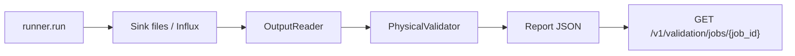

# 07 — Diseño del validador físico (Fase 7)

## Contexto

Diseño conceptual (sin código) del componente que materializa las reglas de `04-*` y los experimentos de `05-*`. Respeta vendor read-only (Regla 003) y schema canónico (Regla 002).

**Decisión de ubicación**: nuevo paquete **`extensions/bms_physics_validator/`** como hermano de `bms_calibration/`. Justificación:
- Sigue convención workspace `uv` (cada extensión es un paquete instalable).
- No mezcla con calibración (responsabilidades ortogonales).
- Permite import limpio desde `modules/bms-data-generator` y desde tests.
- No requiere modificar `vendor/`.

## Vista general

```mermaid
flowchart LR
  subgraph In["Inputs"]
    DP[Stream/Batch DataPoints<br/>(de ScenarioRunner)]
    Inv[Inventory<br/>(de BMSDomainPlugin)]
    SC[ScenarioConfig<br/>(YAML cargado)]
    FE[FaultEvents<br/>(de FaultInjector, opcional)]
  end

  subgraph Validator["bms_physics_validator/"]
    Sched[Scheduler<br/>which rules apply when]
    PhyV[PhysicalRulesValidator]
    TmpV[TemporalRulesValidator<br/>rate, monotonicity, lag]
    CtxV[ContextValidator<br/>weather, calendar, occupancy]
    AnomV[AnomalyValidator<br/>missing/outlier rates, gaps]
    InfV[InfrastructureValidator<br/>schema, naming, freq, tz]
    Score[RealismScorer]
  end

  subgraph Out["Outputs"]
    Rep[ValidationReport JSON]
    Met[Prometheus metrics<br/>captia_physics_*]
    Log[Structured logs<br/>JSON]
    InfP[InfluxDB physics_metrics bucket]
  end

  DP --> Sched
  Inv --> Sched
  SC --> Sched
  FE --> PhyV
  Sched --> PhyV
  Sched --> TmpV
  Sched --> CtxV
  Sched --> AnomV
  Sched --> InfV
  PhyV --> Score
  TmpV --> Score
  CtxV --> Score
  AnomV --> Score
  InfV --> Score
  Score --> Rep
  Score --> Met
  Score --> Log
  Score --> InfP
```

## Responsabilidades por componente

### Scheduler

```yaml
component: Scheduler
purpose: |
  Decidir qué reglas aplican a cada (stream window | batch dataset).
  Activa reglas según señales presentes en inventory y según fase del runner (live vs backfill).
inputs:
  - Inventory (lista de variables disponibles)
  - ScenarioConfig (live/backfill, faults_enabled, anomalies)
  - WindowSpec (start, end, freq)
outputs:
  - lista de RuleSpec aplicables a la ventana actual
constraints:
  - No ejecuta reglas; solo despacha.
  - No mantiene estado de DataPoints; solo metadata.
notes: |
  Ejemplo: si scenario.live=true, omite reglas que requieren batch agregado mensual
  (postergan hasta acumular suficiente ventana).
```

### PhysicalRulesValidator

```yaml
component: PhysicalRulesValidator
purpose: |
  Aplica reglas de tipo state_consistency, conservation_or_balance, bounded_response,
  occupancy_dependency, fault_signature.
inputs:
  - DataPoints batched por (asset_id, ventana temporal)
  - Inventory (para rangos)
  - FaultEvents (para fault_signature)
outputs:
  - lista de RuleResult: (rule_id, asset_id, window, passed, severity, evidence_metric, ...)
constraints:
  - Trabaja sobre series indexadas (pandas Series) por asset y variable.
  - Stateless entre ventanas (excepto contadores acumulados via Prometheus counters).
example_rules:
  - R-EN-01 (conservación), R-EN-02 (monotonicidad)
  - R-CO2-01 (occupancy_dependency)
  - R-FAULT-01..05 (signatures)
  - R-PW-01 (descomposición lineal)
```

### TemporalRulesValidator

```yaml
component: TemporalRulesValidator
purpose: |
  Aplica reglas de tipo rate_of_change, hysteresis, causal_lag, monotonicity, seasonality.
inputs:
  - Series temporales por (asset, variable)
  - Calendar/tz info
outputs:
  - RuleResult con métricas estadísticas (q99 rate, run lengths, peak phase)
notes:
  - Necesita window grande para algunas reglas (e.g., seasonality requiere ≥ 1 mes).
  - Optimizable con cómputos rolling.
example_rules:
  - R-T-01 (rate_of_change temperature)
  - R-OT-01 (rate outdoor)
  - R-HVAC-EN-03 (hysteresis runs)
  - R-CO2-02 (causal_lag con HVAC)
  - R-WX-01 (seasonality estacional)
```

### ContextValidator

```yaml
component: ContextValidator
purpose: |
  Valida coherencia con contexto exterior (calendario, meteo, schedule).
inputs:
  - Series + ValenciaSchoolCalendar (o equivalente)
  - outdoor_temp / daylight_lux como referencia
outputs:
  - RuleResult con desviaciones contextuales (e.g., occ>0 en festivo).
example_rules:
  - R-OCC-01 (cero en festivos)
  - R-DL-01 (día/noche coherente con doy)
  - R-WD-01 (energía vs severidad)
```

### AnomalyValidator

```yaml
component: AnomalyValidator
purpose: |
  Mide la cobertura de anomalías de dato configuradas.
inputs:
  - Stream DataPoints + ScenarioConfig.anomalies
outputs:
  - RuleResult de cobertura (e.g., actual_missing_rate vs configured)
example_rules:
  - R-AN-01..03
```

### InfrastructureValidator

```yaml
component: InfrastructureValidator
purpose: |
  Valida schema canónico, naming conventions, frecuencia, timezone.
inputs:
  - Cualquier DataPoint (schema check) + Inventory (catalog coverage)
outputs:
  - RuleResult tipo error (schema crítico) o warning (catalog incompleto)
example_rules:
  - R-INF-01..05
implementation_hint: |
  Reusar `vendor/synthetic-generator/src/synthetic_generator/core/validator.py:ContractValidator`
  para R-INF-01.
```

### RealismScorer

```yaml
component: RealismScorer
purpose: |
  Agregar RuleResults en un score multidimensional (ver `08-physical-realism-score.md`).
inputs:
  - lista de RuleResult
outputs:
  - PhysicalRealismScore (10 dimensiones + score global ponderado)
notes:
  - Pondera por severity (error > warning > info).
  - Pondera por confidence_level (high > medium > low).
  - Marca dimensiones bloqueadas (R-FAULT-* hoy bloqueadas → dimensión "averías" sin score, no penaliza al global).
```

## Modelo de datos

### Input: stream o batch DataPoints

```yaml
DataPoint:
  asset_id: str (uppercase, e.g., "AULA01")
  variable: str (lowercase, e.g., "temperature")
  value: float | bool | int
  ts_ns: int (epoch ns)
  quality: enum {GOOD, OUTLIER, MISSING}
  data_type: str
  point_type: str
```

Modo de entrada:
- **Live**: stream iterado desde el sink (wrapper sobre `MQTTSinkAdapter`).
- **Batch**: lectura de output `csv_long`/`jsonl` o consulta Influx Flux.

### Output: ValidationReport JSON

```yaml
ValidationReport:
  schema_version: "1.0"
  run_id: str (UUID)
  generated_at: ISO8601
  scenario_config: str (path)
  seed: int
  duration: str
  asset_ids: list[str]
  variables_observed: list[str]
  rules_evaluated: int
  rules_passed: int
  rules_failed: int
  rules_skipped: int (bloqueadas por L-PV-*)
  results: list[RuleResult]
  realism_score:
    global: float (0..1)
    per_dimension: dict[str, float]
  warnings: list[str]
  errors: list[str]

RuleResult:
  rule_id: str (e.g., "R-CO2-01")
  rule_type: str
  severity: enum {error, warning, info}
  confidence_level: enum {high, medium, low}
  passed: bool
  asset_id: str | "*" (all)
  window: {start, end}
  evidence:
    metric_name: str (e.g., "co2_slope_per_occupancy")
    metric_value: float
    expected_range: [min, max] | null
    sample_size: int
  failure_message: str | null
  blocked_by: str | null (L-PV-NN si aplica)
```

## Wiring en el path actual

### Opción A — Wrapper de sink (recomendada)

Insertar un `ValidatingSink` entre `ScenarioRunner` y los sinks reales (MQTT/File/Stdout). Cada `emit()` pasa por el validador antes de delegar al sink real.

```mermaid
flowchart LR
  R[ScenarioRunner] -->|emit(point)| VS[ValidatingSink]
  VS -->|"forward"| Real["MQTTSink<br/>FileSink<br/>StdoutSink"]
  VS -.->|"window full"| PV[PhysicalValidator]
  PV --> M[Metrics & Logs]
```

**Pros**: no toca vendor; integración mínima; reutiliza `SinkAdapterPort`.
**Cons**: validación ventana-basada requiere buffering; latencia para reglas que necesitan ≥ 1 ventana.

**Cambios concretos**:
1. Crear `extensions/bms_physics_validator/src/bms_physics_validator/sink_wrapper.py` con `ValidatingSink(real_sink, validator, window_seconds)`.
2. Modificar `modules/bms-data-generator/src/bms_data_generator/services/runner_service.py:_build_runner` (líneas 91-101) para envolver cada sink con `ValidatingSink` cuando `BMS_PHYSICS_VALIDATION_ENABLED=true`.

### Opción B — Post-run analyzer

Tras `runner.run()` en `_run_job()`, leer la salida (CSV/Influx) y aplicar validador.



**Pros**: simple, no buffer en runtime; ideal para dump (Caso B).
**Cons**: no bloquea ni alerta en live; latencia hasta fin del run.

**Cambios concretos**:
1. Crear `extensions/bms_physics_validator/src/bms_physics_validator/post_run.py` con `validate_csv_long(path) -> ValidationReport`.
2. Añadir endpoint `GET /v1/validation/jobs/{job_id}` en `modules/bms-data-generator/src/bms_data_generator/api/validation.py` (nuevo).
3. Invocar desde `_run_job()` cuando `mode in {backfill, dump}`.

### Opción C — Extensión del domain plugin (más invasiva)

Wrap `BMSDomainPlugin` para interceptar `simulate()` y validar in-flight.

**Pros**: validación temprana, antes incluso de pasar por sink.
**Cons**: requiere PATCH del vendor o `BMSDomainPluginValidated` que herede.

**Recomendación**: **Opción A para live + Opción B para dump**. Opción C solo si en el futuro se quiere validación pre-emisión sin overhead de sink.

## Diseño de la API interna

```yaml
PhysicalValidator:
  __init__(rules: list[RuleSpec], inventory: Inventory, scenario: ScenarioConfig)
  validate_window(points: list[DataPoint], window: TimeWindow) -> list[RuleResult]
  validate_batch(points: pd.DataFrame, window: TimeWindow) -> list[RuleResult]
  finalize() -> ValidationReport

RuleSpec:
  rule_id: str
  rule_type: str
  applicable_when: callable(scenario, inventory) -> bool
  signals_required: list[str]
  evaluator: callable(series_dict, window) -> RuleResult
  severity: str
  confidence_level: str
```

Cada regla se registra como `RuleSpec` en un módulo declarativo:

```text
extensions/bms_physics_validator/src/bms_physics_validator/rules/
  __init__.py        — registry global
  thermal.py         — R-T-01..05
  co2.py             — R-CO2-01..05
  humidity.py        — R-RH-*
  hvac.py            — R-HVAC-MODE-01, R-HVAC-EN-*, R-VLV-*
  occupancy.py       — R-OCC-*
  energy.py          — R-PW-*, R-EN-*
  weather.py         — R-OT-*, R-DL-*, R-WX-*, R-WD-*
  faults.py          — R-FAULT-* (skipped si L-PV-02 no resuelto)
  anomalies.py       — R-AN-*
  infrastructure.py  — R-INF-*
```

## Configuración

```yaml
# config/projects/bms_v1_demo.yaml — sección nueva (opcional)
physics_validation:
  enabled: true
  mode: live | post_run | both    # selecciona Opción A / B / ambas
  window_seconds: 3600            # tamaño ventana para reglas temporales (live)
  buckets:
    physics_metrics: physics_metrics
  prometheus:
    endpoint: /metrics            # mismo endpoint que captia_bms_*
  rules:
    skip:
      - R-RH-02     # gap conocido L-PV-09
      - R-VLV-02    # gap conocido (rate limiter)
    severity_overrides:
      R-HVAC-EN-03: info  # rebajar de warning porque L-PV-07
```

## Métricas Prometheus emitidas (preview, ver `09-*`)

```yaml
captia_physics_rule_evaluations_total{rule_id, severity, asset_id, result}
captia_physics_rule_evidence{rule_id, asset_id, metric_name}  # gauge con valor
captia_physics_realism_score{dimension}  # gauge 0..1
captia_physics_realism_score_global  # gauge 0..1
captia_physics_validation_duration_seconds{mode}  # histogram
```

## Entrega de reportes

| Modo | Mecanismo | Latencia | Persistencia |
|------|-----------|----------|--------------|
| Live | Métricas Prometheus + logs JSON tras cada window_seconds | window_seconds (1 min - 1 h) | Prometheus retention 7d, Loki 30d |
| Post-run dump | `ValidationReport` JSON en `/app/output/validation_<job_id>.json` | tras finalizar run | persistente |
| API | `GET /v1/validation/jobs/{job_id}` retorna report | inmediato post-run | en memoria del DumpService |
| Influx | Métricas summary a bucket `physics_metrics` (ver `09-*`) | window_seconds | retención 90d |

## Tests del validador

```yaml
tests:
  unit:
    - tests/unit/test_rules_thermal.py — fixtures de Series con/sin violaciones, comprobar passed.
    - tests/unit/test_rules_co2.py
    - ... uno por familia.
    - tests/unit/test_scheduler.py — lógica applicable_when.
    - tests/unit/test_realism_scorer.py — agregación.
  integration:
    - tests/integration/test_validating_sink.py — wrap MQTTSinkAdapter, run minirun, comprobar metrics.
    - tests/integration/test_post_run_validator.py — leer csv fixture, validar report.
  golden:
    - tests/golden/baseline_7d_passes.json — D-PV-05 debe producir este report.
    - tests/golden/festivo_16d_diagnoses_l_pv_06.json — D-PV-07 debe revelar L-PV-06.
```

## Limitaciones conocidas del diseño

1. **Validación de averías bloqueada**: las reglas `R-FAULT-*` no producen output útil hasta resolver L-PV-02. Diseño preparado para activarlas (no requiere cambio de spec).
2. **Reglas de tipo `seasonality` requieren batches grandes** (≥ 1 mes). En live mode quedan en estado `pending` hasta acumular ventana.
3. **Latencia de live mode**: con `window_seconds=3600`, la primera evaluación completa toma 1h. Aceptable para dashboard, marginal para alertas.
4. **Sin paralelismo entre aulas**: el diseño asume single-threaded. Para 70 aulas con muchas reglas la latencia puede crecer; futuro paralelismo via thread pool.
5. **Memoria**: ventanas grandes (e.g., para validar Caso B 12m) requieren batch processing por chunks. El diseño contempla `validate_batch_chunked(reader, chunk_size_days=30)`.

## Pseudocódigo (no compilable, ilustrativo)

```text
# Live mode (Opción A)
class ValidatingSink(SinkAdapterPort):
    def __init__(self, real_sink, validator, window_seconds=3600):
        self.real_sink = real_sink
        self.validator = validator
        self.buffer = defaultdict(list)  # por asset_id
        self.last_window_end = None

    def emit(self, point):
        self.buffer[point.asset_id].append(point)
        if self._window_full(point.ts_ns):
            for asset_id, points in self.buffer.items():
                results = self.validator.validate_window(points, window=...)
                self._emit_metrics(results)
                self._emit_logs(results)
            self.buffer.clear()
        self.real_sink.emit(point)

# Post-run mode (Opción B)
def validate_csv_long(path: Path, scenario: ScenarioConfig) -> ValidationReport:
    df = pd.read_csv(path)
    inventory = build_inventory_from_scenario(scenario)
    validator = PhysicalValidator(
        rules=ALL_RULES,
        inventory=inventory,
        scenario=scenario,
    )
    for asset_id, asset_df in df.groupby("asset_id"):
        for window in iter_windows(asset_df, window_size_h=24):
            validator.validate_window(window.to_dict("records"), window=window)
    return validator.finalize()
```

## Cómo evolucionará el diseño

| Etapa | Acción |
|-------|--------|
| v1 (este spec set) | Diseño conceptual completo, sin código. |
| v1.1 | Implementar Opción B (post-run analyzer) primero — menos invasivo. Cubre Casos B, C, D. |
| v1.2 | Implementar Opción A (ValidatingSink) — cubre Caso A live. |
| v2 | Wire `FaultInjector` y `FaultEventSink` (resuelve L-PV-02). Activa R-FAULT-*. |
| v2.1 | Integrar `MinOnOffTimer` en HVAC (resuelve L-PV-07). Sube confidence de R-HVAC-EN-03. |
| v3 | Calibración real desde IES Simarro (resuelve L-01). Sube confidence de R-CO2-01, R-EN-3, R-WX-01. |
