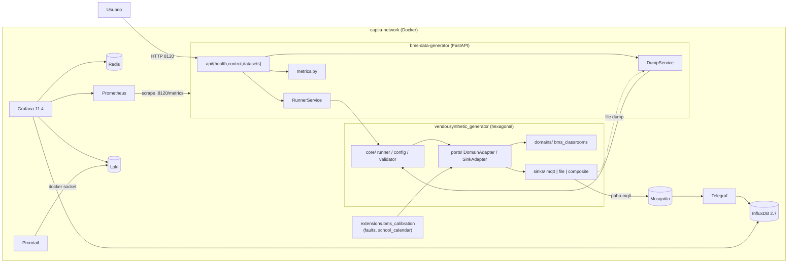
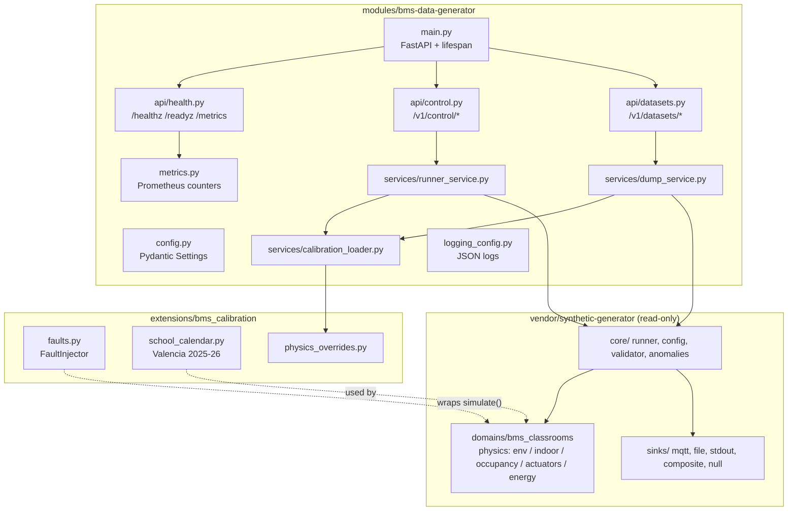
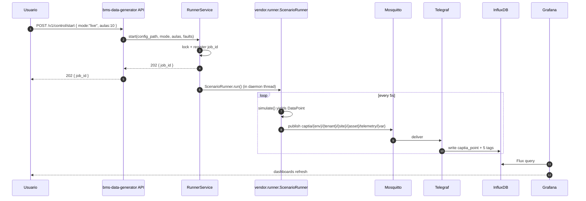

# 03 — Architecture spec

## Context

El microservicio BMS es un wrapper FastAPI sobre el generador hexagonal vendorizado, con extensiones locales de calibración y fallos. La arquitectura debe mantener la separación hexagonal del módulo de referencia y respetar la regla de vendoring read-only.

## High-level diagram



## Module layout (interno)

```
modules/bms-data-generator/src/bms_data_generator/
├── main.py                    # FastAPI app + lifespan
├── config.py                  # Pydantic Settings (env vars)
├── api/
│   ├── control.py             # POST /v1/control/{start,stop,status}
│   ├── datasets.py            # POST /v1/datasets/export
│   └── health.py              # /healthz, /readyz, /metrics
├── services/
│   ├── runner_service.py      # Wrapper sobre vendor.runner.ScenarioRunner
│   ├── dump_service.py        # Backfill → line protocol → file
│   └── calibration_loader.py  # Carga faults.yaml + physics overrides
├── metrics.py                 # prometheus_client counters/gauges
└── logging_config.py          # JSON logs estructurados

extensions/bms_calibration/src/bms_calibration/
├── faults.py                  # FaultInjector (4 tipos)
├── school_calendar.py         # Calendario Valencia 2025-2026
└── physics_overrides.py       # Hooks calibración real (defaults None)

vendor/synthetic-generator/    # Read-only, snapshot from CAPTIA-CONNECT
└── ...
```

## Reglas de import (verificadas con grep)

1. `vendor/synthetic-generator/core/` no importa nada de:
   - `vendor/synthetic-generator/domains/`
   - `vendor/synthetic-generator/sinks/`
   - `bms_data_generator/`
   - `bms_calibration/`

2. `extensions/bms_calibration/` puede importar:
   - `vendor.synthetic_generator.ports.*` (interfaces)
   - `vendor.synthetic_generator.core.models` (DataPoint, Inventory)

3. `extensions/bms_calibration/` NO debe importar:
   - `vendor.synthetic_generator.sinks.*`
   - `vendor.synthetic_generator.domains.bms_classrooms.physics.*`

4. `modules/bms-data-generator/services/` orquesta vía API pública:
   - `vendor.synthetic_generator.core.runner.ScenarioRunner`
   - `vendor.synthetic_generator.domains.registry.get_domain`
   - `vendor.synthetic_generator.sinks.{mqtt,file,composite}`
   - `bms_calibration.{faults, school_calendar, physics_overrides}`

## Diagrama de componentes internos



## Flujo de datos — Caso A (Pipeline IoT en vivo)

```
1. POST /v1/control/start { mode:"live", aulas:10, faults:["valve_stuck"] }
2. RunnerService.start():
   - load_scenario_config(/app/config/projects/bms_v1_demo.yaml)
   - get_domain("bms_classrooms")
   - build_inventory(asset_ids=AULA01..AULA10)
   - if faults: FaultInjector wrap simulate()
   - sink = MQTTSinkAdapter(broker=mosquitto:1883, qos=1)
   - threading.Thread(target=ScenarioRunner.run)
3. Por cada timestamp (5 s):
   - simulate() yields DataPoint
   - faults inyecta eventos → bucket state_events
   - MQTTSink publica:
       topic: captia/dev/default/ies_simarro/AULA03/telemetry/co2
       payload: {"value": 712.3, "ts_ns": 1715260800000000000}
   - Counter Prometheus: captia_bms_messages_published_total{topic}
4. mosquitto → telegraf consumer
5. Telegraf parsea, extrae 5 tags vía regex, escribe captia_point a influxdb
6. Tareas Flux: telemetry → telemetry_1m → _15m → _1h
7. Grafana queries → dashboards
```

### Secuencia Caso A



## Flujo de datos — Caso B/C (Backfill + dump)

```
1. POST /v1/datasets/export { months:12, format:"line_protocol", include_faults:true }
2. DumpService.export():
   - Crear job_id; lanzar thread
   - load_scenario_config(/app/config/projects/bms_v1_caseB_consumption.yaml)
   - sink = FileSinkAdapter(format="csv_long")  # output: /app/output/...lp
   - ScenarioRunner.run() en modo backfill
   - Writer convierte DataPoint → line protocol
   - Compresión gz + sha256 checksum
3. GET /v1/datasets/jobs/{job_id} → status, output_path, duration
```

## Decisiones técnicas (referencia a 09-decision-log.md)

| Decisión | Razón | ADR |
|----------|-------|-----|
| Vendoring synthetic-generator | Permite parchear sin modificar upstream | ADR-001 |
| Stack Docker autónomo | Repo demo-able sin CAPTIA-CONNECT | ADR-002 |
| FastAPI control plane | Estándar del repo padre | ADR-003 |
| Schema canónico CAPTIA | Compatibilidad con Telegraf existente | ADR-004 |
| Topics MQTT exactos | Replicar Telegraf consumer | ADR-005 |
| 7 buckets InfluxDB con retenciones (incluye `telemetry_events` operativo) | Replicar data-plane existente + soporte cmd/ack | ADR-006 |
| Frecuencia 5 s telemetry | Cubre Casos A y B | ADR-007 |
| `seed=42` default | Determinismo reproducible | ADR-008 |
| 10 aulas default | Volumen demo manejable | ADR-009 |
| 4 tipos de fallos HVAC | Caso C cubierto sin overengineering | ADR-010 |
| Grafana provisioning | Sin UI custom v1 | ADR-011 |

## Acceptance criteria

| ID | Criterio | Validación |
|----|----------|-----------|
| AR-01 | `core/` no tiene imports de `domains/` ni `sinks/` | `grep -r "from synthetic_generator.domains" vendor/synthetic-generator/src/synthetic_generator/core/` vacío |
| AR-02 | `extensions/bms_calibration/` no importa sinks ni physics del vendor | `grep -r "from synthetic_generator.sinks\|from synthetic_generator.domains.bms_classrooms.physics" extensions/bms_calibration/src/` vacío |
| AR-03 | `modules/bms-data-generator/` orquesta vendor + extensions vía API pública | Code review |
| AR-04 | Health endpoints disponibles en `:8120` | `curl http://localhost:8120/healthz` 200 |
| AR-05 | MQTT publish honra schema canónico | `tests/integration/test_canonical_schema.py` |
