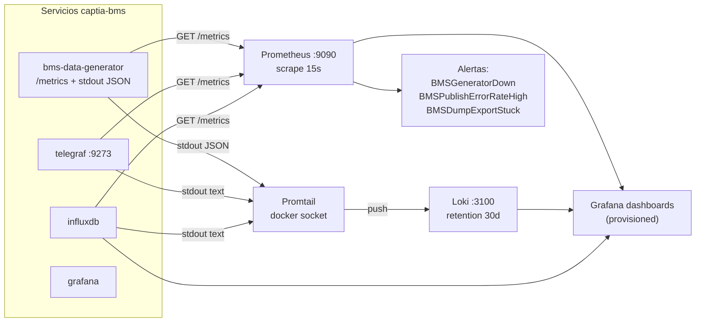

# 05 — Observability spec

## Context

La observabilidad replica el patrón CAPTIA-CONNECT (`modules/observability/{prometheus,loki,promtail,grafana}/`). Combina métricas Prometheus del propio generador con logs estructurados JSON y dashboards Grafana provisionados.

### Pipeline de observabilidad



## Métricas Prometheus

### Existentes en vendor (`vendor/synthetic-generator/health.py`)

- `captia_generator_messages_published_total{topic}`
- `captia_generator_publish_errors_total{topic,reason}`
- `captia_generator_points_generated_total`
- `captia_generator_uptime_seconds`
- `captia_generator_connected`

### Adicionales del wrapper BMS (`bms_data_generator.metrics`)

- `captia_bms_messages_published_total{topic}` (Counter)
- `captia_bms_publish_errors_total{topic,reason}` (Counter)
- `captia_bms_points_generated_total{domain,asset}` (Counter)
- `captia_bms_faults_injected_total{fault_type}` (Counter)
- `captia_bms_dump_export_seconds{format}` (Counter cumulativo)
- `captia_bms_uptime_seconds` (Gauge)
- `captia_bms_connected` (Gauge 0/1)
- `captia_bms_active_jobs` (Gauge)

### Endpoint

- `GET /metrics` en `:8120` formato `prometheus_client`.

## Logs estructurados

### Formato

JSON line-per-event vía `python-json-logger`:

```json
{"ts":"2026-05-09T15:42:11.234Z","level":"INFO","logger":"bms_data_generator.runner","message":"Started backfill","job_id":"abc123","aulas":10}
```

### Campos obligatorios

- `ts`: ISO 8601 UTC (rename de `asctime`).
- `level`: rename de `levelname`.
- `logger`: rename de `name`.
- `message`: rename de `message`.

### Campos opcionales

- `trace_id`: si OpenTelemetry está activo.
- `job_id`, `asset_id`, `topic`: contexto operacional.

### Configuración

`bms_data_generator.logging_config.setup_logging(level)` se invoca en `lifespan` de FastAPI.

## Loki + Promtail

### Loki retention

- 30 días default (`infra/loki/loki-config.yml`).

### Promtail scrape

- Filtro Docker socket: `com.docker.compose.project=captia-bms`.
- Labels extraídos: `container`, `service`, `compose_project`.
- Pipeline JSON parse específico para `bms-data-generator` (extrae `level`, `job_id`).
- Pipeline regex para mosquitto/telegraf/influxdb/redis/grafana.

## Grafana

### Versión

- `grafana/grafana:11.4.0` con plugin `redis-datasource` (build local en `infra/grafana/Dockerfile`).

### Provisioning

- `infra/grafana/provisioning/datasources/`:
  - `influxdb.yaml` → InfluxDB 2.7 (Flux), URL `http://influxdb:8086`, token vía env.
  - `prometheus.yaml` → Prometheus, URL `http://prometheus:9090`.
  - `loki.yaml` → Loki, URL `http://loki:3100`.
- `infra/grafana/provisioning/dashboards/default.yaml` → apunta a `/var/lib/grafana/dashboards`.

### Dashboards

| Dashboard | Archivo | Paneles |
|-----------|---------|---------|
| Overview | `bms_overview.json` | Estado servicios, tasa publish, errores, points generated, uptime |
| IAQ Caso D | `bms_iaq_caseD.json` | CO2, Tª interior, RH, sound, luminosity, occupancy por aula |
| Consumption Caso B | `bms_consumption_caseB.json` | power_01 por aula, T_outdoor, solar_irradiance, totales diarios |
| Faults Caso C | `bms_faults_caseC.json` | Fallos activos, histórico, distribución por tipo, MTTF |

## Alertas Prometheus

`infra/prometheus/rules/bms_alerts.rules.yml`:

```yaml
groups:
  - name: bms_alerts
    rules:
      - alert: BMSGeneratorDown
        expr: up{job="bms-data-generator"} == 0
        for: 1m
        annotations:
          summary: "BMS generator is down"

      - alert: BMSPublishErrorRateHigh
        expr: rate(captia_bms_publish_errors_total[5m]) > 0.01
        for: 5m
        annotations:
          summary: "BMS publish error rate above 1%"

      - alert: BMSDumpExportStuck
        expr: captia_bms_active_jobs > 0 and changes(captia_bms_points_generated_total[10m]) == 0
        for: 10m
        annotations:
          summary: "Dump export stuck (no points generated in 10m)"
```

## Buckets InfluxDB — comportamiento esperado

El stack provisiona 7 buckets aplicativos (sin contar `_monitoring` y `_tasks`
internos). Cada uno tiene una población esperada según el modo de ejecución:

| Bucket | Measurement | Origen | Standalone (este repo) | Producción (con captia-connect) |
|--------|-------------|--------|------------------------|--------------------------------|
| `telemetry` | `captia_point` | Telegraf consumer de `captia/+/+/+/+/telemetry/+` | **Poblado en vivo** (~12K puntos/5min con 10 aulas × 21 vars × 5s) | Igual + tráfico real de gateways/sensores |
| `telemetry_1m` | `captia_point` (downsample) | Flux task `downsample_*_1m` | Poblado a partir del primer minuto | Igual |
| `telemetry_15m` | `captia_point` (downsample) | Flux task `downsample_15m` (cascada desde 1m) | Poblado a los 15 min | Igual |
| `telemetry_1h` | `captia_point` (downsample) | Flux task `downsample_1h` (cascada desde 15m) | Poblado a la hora | Igual |
| `state_events` | `captia_point_state` | Telegraf clone+dedup (vars `*_state`, `*_sp`, `fault.*`, `ac_control`, `aire_state`, `valve_control`) | **Poblado en vivo** (~600 puntos/5min, 12 vars on-change) | Igual |
| `telemetry_events` | `captia_cmd_event` | Telegraf consumer de `captia/+/+/+/+/event/+` | **VACÍO esperado** | Poblado por controllers (cmd/ack) |
| `captia_metadata` | `captia_point_meta` | `infra/influxdb/init/init_buckets_tasks.sh` (one-shot al setup) | **21 entries** (catálogo de variables canónicas con `category`, `metric_kind`, `unit`) | Igual + entries adicionales para cada partner integrado |

> **`telemetry_events` vacío en standalone es comportamiento DOCUMENTADO**.
> Este bucket recibe únicamente eventos de control bidireccional (`cmd_id`,
> `ack`, `reason`) que solo emite un controller real (ej. CAPTIA-CONNECT
> con SCADA conectado). El generador sintético publica únicamente
> `telemetry/`, nunca `event/`. Para validar el bucket es funcional, basta
> con `mosquitto_pub` manual a `captia/dev/test/site/dev/event/cmd` con
> payload `{"value": 1, "ts_ns": <epoch_ns>, "cmd_id": "x"}`.

## Smoke observability

`task smoke:obs` ejecuta:

- `curl -fsS http://localhost:9090/api/v1/targets` → ≥ 1 target `bms-data-generator` UP.
- `curl -fsS http://localhost:3100/ready` → 200 ready.
- `curl -fsS http://localhost:3001/api/health` → 200 ok.

## Acceptance criteria

| ID | Criterio | Validación |
|----|----------|-----------|
| OB-01 | `/metrics` devuelve formato Prometheus con métricas BMS | `curl :8120/metrics \| grep captia_bms_` |
| OB-02 | Logs son JSON parseables | `docker logs captia-bms-generator \| head -1 \| python -c "import sys,json;json.loads(sys.stdin.read())"` |
| OB-03 | Promtail captura logs en Loki | Query Loki `{compose_project="captia-bms"}` muestra logs |
| OB-04 | Datasources Grafana provisionados (sin manual) | `curl :3001/api/datasources` con auth muestra 3 datasources |
| OB-05 | 4 dashboards visibles en Grafana | UI Grafana o `curl :3001/api/search?type=dash-db` muestra ≥ 4 |
| OB-06 | Alertas Prometheus cargadas | `curl :9090/api/v1/rules` muestra grupo `bms_alerts` |
