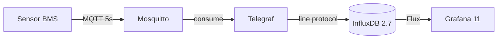

# Caso A — Pipeline IoT CENTINELA+

> **Última verificación:** 2026-05-10
> **Audiencia:** equipo encargado del pipeline o material de referencia.
> **Capa Medallion primaria:** bronce → plata.
> **Notebooks:** 3 (`notebooks/01_case_A_pipeline_iot/`).

## Objetivo

Reproducir el flujo completo de CENTINELA+ con sensores reales:



El equipo Caso A es el único que recorre el camino bronce → plata tal y
como ocurre en producción, incluyendo MQTT y Telegraf. El resto de equipos
puede insertar directamente en InfluxDB con `influx write`.

## Datos esperados

- **Bronce:** CSV In-Gauge / En-Gage o equivalente (`Indoor_CO2`,
  `Indoor_Temp`, …). Mock disponible en
  `notebooks/_data/ingauge_aula01_mock.csv` (1 semana × 1 min).
- **Mocks adicionales:** opcionales si CAPTIA proporciona dump.

## Capas Medallion

- **Bronce** — payload MQTT en bruto (`{"value": 712, "ts_ns": ...}`).
- **Plata** — `captia_point` con 5 tags y `value` (float).
- **Oro** — dashboards Grafana con queries Flux. No hay artefacto ML.

## Schema CAPTIA aplicado

| Tag | Valor |
|---|---|
| `captia_env` | `dev` |
| `domain_id` | `bms_classrooms` |
| `site_id` | `ies_simarro` |
| `asset_id` | `AULA01` (configurable hasta `AULA70`) |
| `variable` | `co2`, `temperature_01`, `ac_state`, ... |

Topic MQTT canónico:

```
captia/{env}/{tenant}/{site}/{device}/telemetry/{variable}
```

## Notebooks asociados

- `01_explicacion_pipeline_centinela.ipynb` — diagramas + 5 capas.
- `02_publicacion_mqtt_a_influxdb.ipynb` — `paho-mqtt` con velocidad acelerada.
- `03_validacion_telegraf_influx_grafana.ipynb` — query Flux + smoke checks.

## Componentes en el stack

| Servicio | Imagen | Puerto | Healthcheck |
|---|---|---|---|
| Mosquitto | `eclipse-mosquitto:2.0.18` | `1884` (host) | `mosquitto_sub` |
| Telegraf | `telegraf:1.32` | `9273` (metrics) | `curl /metrics` |
| InfluxDB | `influxdb:2.7` | `8087` (host) | `curl /health` |
| Grafana | `grafana:11.4` | `3001` (host) | `curl /api/health` |

## Errores comunes

1. **Topic con 7 niveles**: Telegraf no parsea (regex de 5 grupos falla).
2. **Olvidar `fieldpass = ['value']`**: aparecen fields adicionales.
3. **Confundir `_state` con continuo**: `valve_state=1` debe ir a
   `state_events`, no a `telemetry`.
4. **Hard-coding de `INFLUXDB_TOKEN`**: usar `.env` siempre.

## Reutilización con datos reales

Cuando los sensores físicos del IES Simarro publiquen, basta con apuntar
Telegraf al Mosquitto del edge server (`100.102.212.105`). El código y los
dashboards no cambian.

## Validación

- `tests/integration/test_canonical_schema.py` valida los 5 tags y `value`.
- `make smoke` en CI ejecuta MQTT publish + Influx query + Grafana healthz.
- Suite total **211/211 PASS** (ver
  [auditoría top 20](../audit/AUDIT_REPORT.md)).
